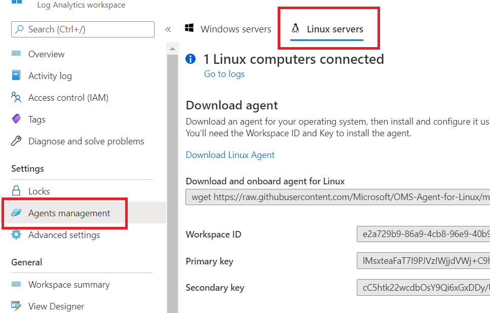

<div class="MCWHeader1">
Securing Azure IoT solutions
</div>

<div class="MCWHeader2">
Hands-on lab step-by-step
</div>

<div class="MCWHeader3">
December 2020
</div>

Information in this document, including URL and other Internet Web site references, is subject to change without notice. Unless otherwise noted, the example companies, organizations, products, domain names, e-mail addresses, logos, people, places, and events depicted herein are fictitious, and no association with any real company, organization, product, domain name, e-mail address, logo, person, place or event is intended or should be inferred. Complying with all applicable copyright laws is the responsibility of the user. Without limiting the rights under copyright, no part of this document may be reproduced, stored in or introduced into a retrieval system, or transmitted in any form or by any means (electronic, mechanical, photocopying, recording, or otherwise), or for any purpose, without the express written permission of Microsoft Corporation.

Microsoft may have patents, patent applications, trademarks, copyrights, or other intellectual property rights covering subject matter in this document. Except as expressly provided in any written license agreement from Microsoft, the furnishing of this document does not give you any license to these patents, trademarks, copyrights, or other intellectual property.

The names of manufacturers, products, or URLs are provided for informational purposes only and Microsoft makes no representations and warranties, either expressed, implied, or statutory, regarding these manufacturers or the use of the products with any Microsoft technologies. The inclusion of a manufacturer or product does not imply endorsement of Microsoft of the manufacturer or product. Links may be provided to third party sites. Such sites are not under the control of Microsoft and Microsoft is not responsible for the contents of any linked site or any link contained in a linked site, or any changes or updates to such sites. Microsoft is not responsible for webcasting or any other form of transmission received from any linked site. Microsoft is providing these links to you only as a convenience, and the inclusion of any link does not imply endorsement of Microsoft of the site or the products contained therein.

© 2020 Microsoft Corporation. All rights reserved.

Microsoft and the trademarks listed at <https://www.microsoft.com/en-us/legal/intellectualproperty/Trademarks/Usage/General.aspx> are trademarks of the Microsoft group of companies. All other trademarks are property of their respective owners.

**Contents** 

<!-- TOC -->

- [Securing Azure IoT solutions hands-on lab step-by-step](#securing-azure-iot-solutions-hands-on-lab-step-by-step)
  - [Abstract and learning objectives](#abstract-and-learning-objectives)
  - [Overview](#overview)
  - [Solution architecture (High-level)](#solution-architecture-high-level)
  - [Solution architecture (Analytics)](#solution-architecture-analytics)
  - [Solution architecture (Data Processing)](#solution-architecture-data-processing)
  - [Solution architecture (Azure Sphere)](#solution-architecture-azure-sphere)
  - [Requirements](#requirements)
  - [Before the hands-on lab](#before-the-hands-on-lab)
  - [Exercise 1: Secure and configure IoT Hub and Device Provisioning Service](#exercise-1-secure-and-configure-iot-hub-and-device-provisioning-service)
    - [Task 1: Link Device Provisioning Service to IoT Hub](#task-1-link-device-provisioning-service-to-iot-hub)
    - [Task 2: Enable Azure Security Center for IoT](#task-2-enable-azure-security-center-for-iot)
    - [Task 3: Enable Azure Audit logging](#task-3-enable-azure-audit-logging)
    - [Task 4: Configure diagnostic logging on IoT Hub](#task-4-configure-diagnostic-logging-on-iot-hub)
    - [Task 5: Configure diagnostic logging on Device Provisioning Service](#task-5-configure-diagnostic-logging-on-device-provisioning-service)
  - [Exercise 2: Enroll and provision IoT devices](#exercise-2-enroll-and-provision-iot-devices)
    - [Task 1: Configure your devices](#task-1-configure-your-devices)
    - [Task 2: Update and install Azure IoT SDK prerequisites](#task-2-update-and-install-azure-iot-sdk-prerequisites)
    - [Task 3: Download and compile the Azure IoT SDK](#task-3-download-and-compile-the-azure-iot-sdk)
    - [Task 4: Attempt device enrollment](#task-4-attempt-device-enrollment)
    - [Task 5: Install a software TPM and Resource Manager and reattempt Device Enrollment](#task-5-install-a-software-tpm-and-resource-manager-and-reattempt-device-enrollment)
  - [Exercise 3: Install and configure IoT Edge](#exercise-3-install-and-configure-iot-edge)
    - [Task 1: Install IoT Edge](#task-1-install-iot-edge)
    - [Task 2: Configure the IoT Edge agent](#task-2-configure-the-iot-edge-agent)
  - [Exercise 4: Install Azure Security IoT agent](#exercise-4-install-azure-security-iot-agent)
    - [Task 1: Install the Security agent](#task-1-install-the-security-agent)
    - [Task 2: Install the IoT Hub Security Agent Module](#task-2-install-the-iot-hub-security-agent-module)
  - [Exercise 5: Simulate IoT attacks](#exercise-5-simulate-iot-attacks)
    - [Task 1: Setup and execute attack scripts](#task-1-setup-and-execute-attack-scripts)
    - [Task 2: Configure Azure Agent](#task-2-configure-azure-agent)
    - [Task 3: Perform brute force attack (Optional)](#task-3-perform-brute-force-attack-optional)
  - [Exercise 6: Configure security and alerts](#exercise-6-configure-security-and-alerts)
    - [Task 1: Create IoT Baseline checks](#task-1-create-iot-baseline-checks)
    - [Task 2: Review Azure Security for IoT log data](#task-2-review-azure-security-for-iot-log-data)
    - [Task 3: Create custom security alerts for device events](#task-3-create-custom-security-alerts-for-device-events)
    - [Task 4: Create custom security alerts for azure events](#task-4-create-custom-security-alerts-for-azure-events)
    - [Task 5: Send a DirectMethod](#task-5-send-a-directmethod)
    - [Task 6: Device Investigation with Logs](#task-6-device-investigation-with-logs)
  - [Exercise 7: Device Messaging and Time Series Insights](#exercise-7-device-messaging-and-time-series-insights)
    - [Task 1: Setup Time Series Insights](#task-1-setup-time-series-insights)
    - [Task 2: Send Security Messages](#task-2-send-security-messages)
    - [Task 3: Review the Time Series Portal](#task-3-review-the-time-series-portal)
  - [Exercise 8: Perform an IoT Hub Manual Failover](#exercise-8-perform-an-iot-hub-manual-failover)
    - [Task 1: Perform a manual failover](#task-1-perform-a-manual-failover)
  - [After the hands-on lab](#after-the-hands-on-lab)
    - [Task 1: Delete resource group](#task-1-delete-resource-group)

<!-- /TOC -->

# Securing Azure IoT solutions hands-on lab step-by-step

## Abstract and learning objectives

In this hands-on-lab, you will implement an IoT solution that utilizes the latest Azure Security IoT features.  Specifically, you will provision a set of Azure resources that will securely manage your IoT infrastructure and devices.  This includes provisioning Azure IoT Edge devices with supporting modules and agents.

Once deployed and configured, you will simulate various events from the devices that will then generate specific alerts in the Azure Security Center for IoT.  You can then use these alerts to diagnosis issues with your devices and execute commands to remediate those issues.

At the end of this lab, you will have a better understanding of how the latest Azure Security features work with IoT environments as well as how to install, configure and troubleshoot issues.

## Overview

Contoso, Ltd. has major holdings in one of the world’s most important oil-producing regions. To overcome the challenges of monitoring and optimizing a vast number of widely dispersed field assets, Contoso, Ltd. is looking to streamline its operations with IoT solutions. They want to deploy IoT technologies to electronically collect data and use cloud-based solutions to store and analyze it in order to gain new insights into well operations and future drilling possibilities.

Their environments are very tough environments in which to work. The climate is hot, harsh, and unforgiving, and oil wells are often spaced many miles apart, so field technicians can spend much of their day just driving from one to another. Cellular and radio reception is spotty at best, so collecting data about well conditions and performance typically involves manually writing down information. The technician must then make the long trek to the central office at the end of the day to upload the data for analysis. With such remote situations, a key concern for Contoso is not only how they manage these remote devices, but more broadly how they secure the complete solution that encompasses the physical device, the software on the device, the services processing the data in the cloud and the network connecting it all.

Contoso plans to tie into existing sensors at the well head that monitor key system parameters like temperatures, pressures, and flow rates. They will deploy gateway devices to route device data for processing, storage and analytics. Internal IT staff and engineers want to visualize the high-resolution data and deliver near real-time analyses. The company is placing a premium on flexibility and ease of use, with security as a fundamental driver.

In addition, they would also like the solution to yield benefits to their workers in the field. “The field technicians and lease operators already have tools on their phones that they use every day to see what a well is doing,” explains Miles Strom. “Our goal is to connect these tools to live data from the IoT sensors. So, instead of seeing low-resolution volumes or flow rates, they’ll see what is happening in real time. This way they can respond immediately to problems that lead to downtime or maintenance issues.”

They have implemented a proof-of-concept solution for collecting and analyzing device telemetry using IoT Hub, but are interested in learning about any related services in Azure that would help them to secure such solutions.

## Solution architecture (High-level)


## Solution architecture (Analytics)


## Solution architecture (Data Processing)


## Solution architecture (Azure Sphere)


> **Note**: These labs focus solely on device security and do not explore analytics or data processing at depth. Stream Analytics and Service Bus are not presented in these labs. Additionally, you would need Azure Sphere hardware and connectivity to such devices in order to review full end to end (E2E) security components and topics such as highly secure remote upgrades. As such, you will not see these topics covered in these labs.

## Requirements

1. Microsoft Azure subscription must be pay-as-you-go or MSDN.

    - Trial subscriptions will not work.

## Before the hands-on lab

Refer to the Before the hands-on lab setup guide manual before continuing to the lab exercises.

## Exercise 1: Secure and configure IoT Hub and Device Provisioning Service

Duration: 15 minutes

In this exercise you will link your provisioning service to your IoT Hub.  Once this is complete, you will enable the Azure Security Center for IoT on your IoT Hub.  With this plumbing in place, you can start to create your device enrollments and to provision your IoT devices.

You will also enable diagnostic logging such that you can create custom alerts later in this lab.

### Task 1: Link Device Provisioning Service to IoT Hub

1. Open the Azure Portal.

2. Browse to your lab resource group.

3. Select the **oilwells-prov-[YOUR INITS]** device provisioning resource.

4. In the Device Provisioning Service blade, under **Settings**, select **Linked IoT Hubs**.

5. Select **+Add**.

    

6. Select the **oilwells-iothub-[YOUR INITS]** IoT hub.

7. Select the **iotowner** access policy.

    

8. Select **Save**.

### Task 2: Enable Azure Security Center for IoT

1. Navigate back to your resource group.

2. In the menu, select the **oilwells-iothub-[YOUR INITS]** IoT Hub.

3. In the resource blade, scroll down to the **Security** section and select **Overview**.

4. In the overview area, select **Secure your IoT solution**.

    

5. Refresh the Security Overview page, you should now see the **Threat prevention** and **Threat detection** KPIs.

6. In the blade navigation, under **Security**, select **Settings**.

    

7. In the settings page, select **Data Collection**.

8. Ensure **Enable Azure Defender for IoT** is selected.

9. Toggle the switch for the log analytics to **On**.

10. For the workspace, select **oilwells-logging-[YOUR INIT]**.

    

11. Select **Save**. Wait for the operation to complete.

### Task 3: Enable Azure Audit logging

1. Navigation back to your **iotsecurity-\[your initials or first name\]** resource group.

2. In the blade menu, select **Activity Log**.

3. In the top menu, select **Logs**.

    

4. Select the **diagnostic settings** link.

5. Select your lab subscription.

6. then select the **Add diagnostic setting** link.

7. For the name, type **iotsecuritylogging**.

8. Select all the checkboxes.

9. Select the **Send to Log Analytics** checkbox.

10. Select the **oilwells-logging-[YOUR INIT]**.

11. In the top menu, select **Save**, this will send all Azure level configuration and diagnostic events to the Log Analytics workspace.

### Task 4: Configure diagnostic logging on IoT Hub

1. Navigate back to your resource group, select the **oilwells-iothub-[YOUR INIT]** IoT hub.

2. In the blade menu, scroll to the **Monitoring** section, then select **Diagnostic settings**.

3. Select **Add diagnostic setting**.

    

4. For the name, type **oilwells-iothub-logging**.

5. Enable the **Send to Log Analytics** checkbox, and then select the **oilwells-logging-[YOUR INIT]** workspace.

6. Enable all the `log` checkboxes and the `metric` checkbox.

    

7. Select **Save**.

### Task 5: Configure diagnostic logging on Device Provisioning Service

1. Navigate back to your resource group, select the **oilwells-prov-[YOUR INIT]** IoT Device Provisioning Service.

2. In the blade menu, scroll to the **Monitoring** section, then select **Diagnostic settings**.

3. Select **Add diagnostic setting**.

4. For the name, type **oilwells-prov-logging**.

5. Enable the **Send to Log Analytics** checkbox, and then select the **oilwells-logging-[YOUR INIT]** workspace.

6. Enable all the LOG checkboxes.

7. Select **Save**.

>**Note**:  It may take 5-10 minutes for event data to populate into the Log Analytics and then for Security Center recommendations to display.

## Exercise 2: Enroll and provision IoT devices

Duration: 30 minutes

With the Azure resources in place, you can now start creating and provisioning devices into your Azure IoT hub.  Here you will create several devices and configure them with the Azure IoT SDK, agents and modules to allow you to provision and utilize the security services offered by Azure.

### Task 1: Configure your devices

1. Navigate to your lab Azure Resource Group.

2. Select the **oilwells-server-[YOUR INIT]** virtual machine.

3. Select **Connect**, then select **RDP**, then select **Download RDP File**.

4. Open the downloaded rdp file, login using `s2admin` and password `S2@dmins2dmin`.

5. If prompted, select **Accept** in the dialog.

6. Open the Hyper-V manager mmc, select the **Server-[YOUR INIT}** then select the `Ubuntu` image, start it if not started.

7. When the VM has started, enter the password **S2@dmins2@dmin**.  You should now be logged into the device.

8. If prompted to upgrade to **20.04**, select **Don't Upgrade**.

### Task 2: Update and install Azure IoT SDK prerequisites

1. In the Hyper-V Ubuntu guest, open a `terminal` session. You should see a link in the right-hand favorites bar (you can also select the bottom right icon, then scroll down to the terminal application or search for terminal).

2. Run the following commands, this could take up to 10 minutes to complete.

    - Depending on your hosting environment and command line tool (cmd.exe, bash, PowerShell, etc.), you may need to run each line one at a time to avoid skipping any commands. You are updating and upgrading as some required packages will requires these updates.

    - Again, depending on your hosting environment, you may find it easier to download and run these in a [Putty](https://the.earth.li/~sgtatham/putty/latest/w64/putty-64bit-0.73-installer.msi) session.

    - The following commands may take 20-30 minutes to complete.

    > **Note**: You may want to open the MCW GitHub HOL (https://microsoftcloudworkshop.com) document in the virtual machine to copy/paste the commands easier.

- For Ubuntu 18.04 (Lab default):

    ```PowerShell
    sudo apt-get -y update
    sudo apt-get -y upgrade

    sudo apt-get install -y git cmake build-essential curl

    sudo apt-get install -y libcurl4 libcurl4-openssl-dev libssl-dev uuid-dev
    sudo apt-get install -y auditd audispd-plugins

    sudo reboot
    ```

- For Ubuntu 16.04:

    ```PowerShell
    sudo apt-get -y update
    sudo apt-get -y upgrade

    sudo apt-get install -y git cmake build-essential curl libcurl4-openssl-dev libssl-dev uuid-dev

    sudo apt-get install -y libcurl3
    sudo apt-get install -y auditd audispd-plugins

    sudo reboot
    ```

> **Note** Ubuntu 20.04 will not work with these labs.

### Task 3: Download and compile the Azure IoT SDK

1. Wait for the server to reboot and ssh back into it, the password is **S2@dmins2@dmin**.

2. Run the following commands:

> **Note**: You can find the latest release of the Azure IoT SDK [here](https://github.com/Azure/azure-iot-sdk-c/releases).  You can open the git to see what the latest release tag is, but the remainder of the lab may not work properly based on a new release.

```PowerShell
git clone https://github.com/Azure/iotedge --recursive

git clone -b LTS_07_2020_Ref01 https://github.com/Azure/azure-iot-sdk-c.git --recursive

cd azure-iot-sdk-c

git submodule update --init
```

Determine if you have a hardware-based TPM by running the following and observing if you get any results back.

```bash
dmesg | grep -i tpm
```

For these labs, you should see the Microsoft Virtual TPM displayed:


If you are using a `hardware-based` simulator, then run the following command:

```PowerShell
cmake -Duse_prov_client:BOOL=ON -Duse_tpm_simulator:BOOL=OFF .
```

Otherwise with a `software-based` TPM, run the following:

```PowerShell
cmake -Duse_prov_client:BOOL=ON -Duse_tpm_simulator:BOOL=ON .
```

Whether software or hardware, setup the new registration and endorsement key tool by running the following:

```PowerShell
cd provisioning_client/tools/tpm_device_provision

make
```

### Task 4: Attempt device enrollment

1. Run the following commands:

```PowerShell
sudo ./tpm_device_provision
```

>**Note**:  This command will fail on a device that does not have a hardware or software TPM installed.  In order to utilize a hardware-based TPM, you would need an actual device with a TPM security chip, or a nested machine with a TPM enabled virtual machine running.  The Azure ARM template provisions an Azure VM Ubuntu image that does not have a hardware TPM enabled nor does it have a software TPM installed.  However, the Windows 10 `server` image does have a Gen2 image setup that allows nested virtualization with a Hyper-V Virtual TPM installed.


### Task 5: Install a software TPM and Resource Manager and reattempt Device Enrollment

>**Note**: If you have a hardware TPM in your device, you can skip to step 3, again you can determine if you have a TPM device by running the following and observing if you get any results back.

```bash
dmesg | grep -i tpm
```

>**Note**: Devices such as a Raspberry PI do not come with a TPM chip.  You can however add a TPM chip to these devices such as [this Iridium Board](https://catalog.azureiotsolutions.com/details?title=OPTIGA-TPM-SLB-9670-Iridium-Board&source=all-devices-page/).

1. Run the following commands to download, compile and start a software-based TPM server:

    ```PowerShell
    cd

    sudo wget -c https://phoenixnap.dl.sourceforge.net/project/ibmswtpm2/ibmtpm1332.tar.gz

    sudo tar -zxvf ibmtpm1332.tar.gz

    cd ..
    sudo chown -R $USER ~/.

    cd
    cd src
    sudo make

    ./tpm_server &
    ```

    > **Note**: Press Enter to continue entering commands.

    

2. Run the following commands to start a TPM resource manager:

    ```PowerShell
    cd

    sudo apt-get install -y autoconf
    sudo apt-get install -y libtool
    sudo apt-get install -y pkg-config

    sudo wget -c https://netactuate.dl.sourceforge.net/project/ibmtpm20tss/ibmtss1.5.0.tar.gz

    sudo tar -zxvf ibmtss1.5.0.tar.gz

    cd ..
    sudo chown -R $USER ~/.

    cd

    sudo autoreconf -i
    ./configure --prefix=${HOME}/local --disable-hwtpm
    make
    make install

    cd local/bin
    ./tsspowerup &
    ./tssstartup &

    ```

    > **Note**: Press Enter after the tss commands to type more commands.

3. With your hardware or software TPM running, attempt to provision again using the following commands:

    ```PowerShell
    cd
    cd azure-iot-sdk-c/provisioning_client/tools/tpm_device_provision
    sudo ./tpm_device_provision
    ```

    

4. Copy the device **Registration Id** and the **Endorsement Key**.  Note that you may want to do this in the virtual machine rather than typing all the information.

    >**Note**: In the real world, all your devices should have hardware-based TPMs.

5. Switch to the Azure Portal and navigate to the **oilwells-prov-[YOUR INIT]** Device Provisioning Service.

6. Under **Settings**, select **Manage enrollments**.

7. Select **+Add Individual Enrollment**.

    

8. For the **Mechanism**, select **TPM**.

9. Enter your Endorsement Key and Registration Id, then select the **True** toggle for the IoT Edge Device setting.

10. For the **IoT Hub Device ID**, type **oilwells001**.

    

11. Select **Save**.

## Exercise 3: Install and configure IoT Edge

Duration: 30 minutes

In this exercise you will install the Azure IoT Edge agent on your IoT device and then register the new device with your IoT Hub. Note that you can download Ubuntu iotedge pre-installed virtual machine images in the Azure Marketplace.

### Task 1: Install IoT Edge

1. Switch back to your device SSH window, run the following command:

>**Note**: Change the ubuntu version "os_version" as appropriate (`16.04` vs `18.04`).  You can get your version by running `lsb_release -a`.

```PowerShell
cd

curl https://packages.microsoft.com/config/ubuntu/{os_version}/prod.list > ./microsoft-prod.list

sudo cp ./microsoft-prod.list /etc/apt/sources.list.d/

curl https://packages.microsoft.com/keys/microsoft.asc | gpg --dearmor > microsoft.gpg

sudo cp ./microsoft.gpg /etc/apt/trusted.gpg.d/

sudo apt-get update

sudo apt-get install -y moby-engine
sudo apt-get install -y moby-cli

sudo apt-get install -y iotedge
```

### Task 2: Configure the IoT Edge agent

1. Switch to the Azure Portal, open your **oilwells-prov-[YOUR INIT]** device provisioning resource.

2. In the **Overview** blade, copy the **ID Scope**.

    

3. Navigate back to the resource group and open the **oilwells-iothub-[YOUR INIT]** IoT Hub.  

4. Under **Automatic Device Management**, select **IoT Edge**.

5. Select **+Add IoT Edge device**.

    

6. For the Device ID, type **oilwells001**.

    

7. Select **Save**.

8. Select the new **oilwells001** item, copy the primary key and primary device connection strings.

    

9. Switch back to your SSH shell, run the following command to open a text editor:

    ```PowerShell
    sudo nano /etc/iotedge/config.yaml
    ```

10. There are several ways to register your device with the provisioning service.  This includes manually with a device connection string, TPM registration, and symmetric key.  

    The simplest provisioning method is "manual" with a device connection string.  Each way is presented below, you need **only pick one**.  Note that TPM registration requires a software or hardware TPM:

    >**Note**: YAML file structure formats are very specific.  Be sure that the leading lines have "tabs" that are made up of only 2 space characters.

    - Manual Provisioning

        - Using the device connection string you copied from above, paste it into the config.yaml file.

            

        - Save the file, press **CTRL-X**, then **Y**, then **Enter**.

    - Symmetric Key Provisioning

        - Comment out the manual provision settings, uncomment the **DPS symmetric key** settings, then copy in the device primary symmetric key (you will have to change the device registration to this type) and Registration Id information.

        - Save the file, press **CTRL-X**, then **Y**, then **Enter**.

    - Certificate Provisioning

        - You will need to generate a test CA certificate and then device certificates.

        - On the `server-INIT` virtual machine, open a PowerShell  window, run the following.  Be sure to replace the IoT Hub name:

            ```PowerShell

            #https://github.com/Azure/azure-iot-sdk-c/blob/master/tools/CACertificates/CACertificateOverview.md

            #https://docs.microsoft.com/en-us/azure/iot-hub/iot-hub-x509ca-overview#sign-devices-into-the-certificate-chain-of-trust

            mkdir "c:\certs" -ea silentlycontinue

            cd "c:\certs"

            . "C:\LabFiles\azure-iot-sdk-c\tools\CACertificates\ca-certs.ps1"

            Test-CACertsPrerequisites

            #create the CA
            New-CACertsCertChain "rsa"

            $secPassword = ConvertTo-SecureString -String "S2@dmins2@dmin" -AsPlainText -Force;

            #create the device certs (oilwells001, oilwells002)
            New-CACertsEdgeDevice "oilwells001" -certPassword $secpassword

            Write-CACertsCertificatesForEdgeDevice "oilwells001"

            New-CACertsDevice "oilwells002" -certPassword $secpassword

            Write-CACertsCertificatesToEnvironment "oilwells002" {myIotHubName}

            New-CACertsDevice "oilwells003" -certPassword $secpassword

            Write-CACertsCertificatesToEnvironment "oilwells003" {myIotHubName}
            #>
            ```

    - TPM Provisioning

        - Comment out the manual provision settings, uncomment the **dps TPM** settings, then copy in the Id Scope and Registration Id information:

            

        - Although we are using a software TPM, when using a hardware TPM, you would need to give permissions to the hardware TPM to the iotedge service by running the following commands:

        - Save the file, press **CTRL-X**, then **Y**, then **Enter**.

        ```PowerShell
        tpm=$(sudo find /sys -name dev -print | fgrep tpm | sed 's/.\{4\}$//')

        sudo touch /etc/udev/rules.d/tpmaccess.rules
        ```

        - Run the following command to open a text editor:

        ```PowerShell
        sudo nano /etc/udev/rules.d/tpmaccess.rules
        ```

        - Copy the following into the file:

        ```PowerShell
        # allow iotedge access to tpm0
        KERNEL=="tpm0", SUBSYSTEM=="tpm", GROUP="iotedge", MODE="0660"
        ```

        - Execute the following:

        ```PowerShell
        /bin/udevadm trigger $tpm
        ```

        - Reboot the device/machine.
        - Login and re-open the terminal.
        - Check that access has been applied:

        ```bash
        ls -l /dev/tpm0
        ```

        - You should see the following, ensure that `iotedge` is displayed:

        ```bash
        crw-rw---- 1 root iotedge 10, 224 Jul 20 16:27 /dev/tpm0
        ```

11. After completing **one** of the above methods (it is suggested you perform the manual device connection string path for simplicity), run the following commands to restart the iotedge service:

    ```bash
    sudo systemctl restart iotedge
    sudo systemctl status iotedge
    ```

12. You should see the iotedge client status as **active (running)**.  Press **Ctrl-C** to exit the status message.

    

    > **Note**: If you do not see **active (running)**, then run the following command to see diagnostics logs that may help you troubleshoot the issue:

    ```PowerShell
    sudo journalctl -u iotedge
    ```

13. After the above configurations, the IoT Edge modules will be downloaded and created in docker containers. You can review the docker images by running:

    ```PowerShell
    sudo docker ps
    ```

    

## Exercise 4: Install Azure Security IoT agent

Duration: 15 minutes

In this exercise you will install the Azure Security IoT Agent directly and via an Azure IoT Edge module.

### Task 1: Install the Security agent

1. Run the following commands, be sure to replace the ubuntu version:

    >**Note**: Change the ubuntu version "os_version" as appropriate (`16.04` vs `18.04`).  You can get your version by running `lsb_release -a`.

    ```PowerShell
    cd

    git clone https://github.com/Azure/Azure-IoT-Security-Agent-C.git --recursive

    sudo apt-get install -y libcurl3 libcurl-openssl1.0-dev
    sudo apt-get install -y auditd audispd-plugins

    #create release folder
    cd Azure-IoT-Security-Agent-C
    sudo mkdir release
    cd release

    #download the release binaries

    sudo wget -c https://github.com/Azure/Azure-IoT-Security-Agent-C/releases/download/0.0.4/ubuntu-{os_version}-x64.tar.gz

    #extract the release binaries
    sudo tar -zxvf ubuntu-{os_version}-x64.tar.gz

    #copy to target folder
    sudo cp -r Install/. /var/ASCIoTAgent

    cd /var/ASCIoTAgent

    sudo chmod +x InstallSecurityAgent.sh

    #BE SURE TO REPLACE WITH YOUR INIT
    sudo ./InstallSecurityAgent.sh -aui Device -aum SymmetricKey -f /var/certs/key -hn oilwells-iothub-[YOURINIT].azure-devices.net -di oilwells001 -i

    sudo mkdir /var/certs

    sudo nano /var/certs/key
    ```

    > **Note**: The Device Id is case-sensitive.

2. Copy the primary key for the device from the Azure Portal and copy it into the file.

3. Run the following command to start the security agent:

    ```PowerShell
    sudo systemctl start ASCIoTAgent
    sudo systemctl status ASCIoTAgent
    ```

4. The status of the service will not be **started**.  Run the following command:

    ```PowerShell
    sudo journalctl -u ASCIoTAgent
    ```

5. Scroll to the bottom of the logs, you should see an error about the azureiotsecurity module not being registered.

    

### Task 2: Install the IoT Hub Security Agent Module

1. Switch to the Azure Portal.

2. Open the **oilwells-iothub-[YOUR INIT]** IoT Hub.

3. Under **Automatic Device Management**, select **IoT Edge**.

4. Select the **oilwells001** device.

5. In the top nav menu, select **Set Modules**.

    

6. Select **+Add**, then select **IoT Edge Module**.

    

7. In the new dialog, for the **IoT Edge Module Name**, type **azureiotsecurity**.

8. For the Image URI, type:

    ```text
    mcr.microsoft.com/ascforiot/azureiotsecurity:0.0.3
    ```

    

9. Select the **Container Create Options** tab, copy and paste the following:

    ```json
    {
        "NetworkingConfig": {
            "EndpointsConfig": {
                "host": {}
            }
        },
        "HostConfig": {
            "Privileged": true,
            "NetworkMode": "host",
            "PidMode": "host",
            "Binds": [
                "/:/host"
            ]
        }
    }
    ```

10. Select the **Module Twin Settings** tab, copy and paste the following into the twin's desired properties text area:

    ```json
    {
        "azureiot*com^securityAgentConfiguration^1*0*0": {
        }
    }
    ```

11. Select **Add**.

12. Select **Runtime settings**.

13. In the **Edge Hub** section, change the image name to **mcr.microsoft.com/ascforiot/edgehub:1.0.9-preview**, then select **Save**.

14. Select **Next: Routes>**.

15. On the routes dialog, add another route called `ASCForIoTToIoTHub` with the value `FROM /messages/modules/azureiotsecurity/* INTO $upstream`:

    

16. Select **Review + create**.

17. Select **Create**.

18. Switch back to your SSH session, then run the following command to start the security agent:

    ```PowerShell
    sudo systemctl start ASCIoTAgent
    sudo systemctl status ASCIoTAgent
    ```

19. The status should now show **active (running)**.

    

## Exercise 5: Simulate IoT attacks

Duration: 10 minutes

This exercise will have you install some "fake" processes and open some non-standard ports on your IoT device.  Once your attacks have been executed, the Security Agent will pick up these bad configurations and send them to the IoT Hub and the Azure Security Center will notify you.

### Task 1: Setup and execute attack scripts

1. Run the following command:

    ```bash
    sudo apt-get install -y netcat
    ```

2. Download and execute the attack script:

    ```bash
    cd

    git clone https://github.com/Azure/Azure-IoT-Security --recursive

    cd Azure-IoT-Security/trigger_events

    sudo chmod +x trigger_events.sh

    sudo ./trigger_events.sh --exploit

    sudo ./trigger_events.sh --malicious
    ```

    > **Note**: Feel free to explore the trigger events scripts and its different options : https://github.com/Azure/Azure-IoT-Security/tree/master/trigger_events.

### Task 2: Configure Azure Agent

1. In the Azure Portal, browse to your **iotsecurity-INIT** resource group, then select the **oilwells-logging-INIT** Log Analytics Workspace.

2. In the blade, select **Agents Management**.

3. Record the `Workspace ID` and the `Primary key` values.

4. Run the following commands, be sure to replace the workspace tokens with the values you records above:

    ```bash
    cd

    wget https://raw.githubusercontent.com/Microsoft/OMS-Agent-for-Linux/master/installer/scripts/onboard_agent.sh && sh onboard_agent.sh -w <YOUR_WORKSPACE_ID> -s <YOUR_WORKSPACE_KEY>

    sudo /opt/microsoft/omsagent/bin/service_control restart <YOUR_WORKSPACE_ID>

    ```

5. Switch back to the Azure Portal.

6. In the blade menu, select **Agents Management** and then select **Linux Servers**, you should see **1 LINUX COMPUTER CONNECTED**.

    

7. Under **Workspace Data Sources**, select **Virtual Machines**.

8. Select the **oilwells-edgevm-INIT**.

9. Select **Connect**.

    > **Note**: It may take a few minutes for the OMS logs to show up and a heartbeat to be registered in Log Analytics for the IoT Linux machine.

### Task 3: Perform brute force attack (Optional)

1. Repeat the above steps to add the **oilwells-edgevm-INIT** to the device provisioning service and the Iot Hub as **oilwells002**.

2. In the server virtual machine, open a new PowerShell ISE window.

3. Browse to the `\Hands-on-lab\Scripts\BruteForce.ps1` script.

4. Update the script with the IP address of the **oilwells-edgevm-INIT** device.  You can get the IP from the Azure Portal.

5. Press **F5** to run the script. The script will attempt to login to the iot device using the wrong credentials with the plink tool of Putty.

    > **Note**: If the putty version has changed, the script will need to be updated. Browse to [here](https://the.earth.li/~sgtatham/putty/0.74/w64/) to find the latest version.

6. Eventually Azure Security Center will send an email warning of a brute force attack on your IoT Device.

    - Browse to the IoT Hub then under the Security section, select **Alerts**.

    - You should see the brute force alert displayed.

    

    > **Note** We could not do this task on the device in the Windows 10 HyperV as it is not accessible to the HyperV host or from the internet.

## Exercise 6: Configure security and alerts

Duration: 20 minutes

This exercise will evaluate the logs from when you enabled diagnostic logging on your Azure resources and then setup some alerts based on any important configuration changes that an Azure user may make to your IoT infrastructure.

### Task 1: Create IoT Baseline checks

1. Switch to the Azure Portal and your resource group.

2. Select the **oilwells-iothub-[YOUR INIT]** IoT hub.

3. Under **Automatic Device Management**, select **IoT Edge**.

4. Select the **oilwells001** device.

5. Select the **azureiotsecurty** module.

6. Select the **Module Identity Twin** tab.

7. Find the `desired` section of the twin, add the `ms_iotn:urn_azureiot_Security_SecurityAgentConfiguration` property with the following:

    ```json
        "ms_iotn:urn_azureiot_Security_SecurityAgentConfiguration": {
            "baselineCustomChecksEnabled": {
            "value" : true
            },
            "baselineCustomChecksFilePath": {
            "value" : "/home/wsuser/oms_audits.xml"
            },
            "baselineCustomChecksFileHash": {
            "value" : "9026e50c728fe00edcc9d46f2cdb3346425931889730cbf970ccb368dfa2296e"
            }
        }
    ```

    > **Note**: You can use the [sha256sum](https://linux.die.net/man/1/sha256sum) tool in Linux to create a file hash.

    

8. Select **Save**.

9. Switch to your putty session connected to the IoT Device, run the following commands:

    ```bash
    sudo nano /home/wsuser/oms_audit.xml
    ```

10. Copy and paste the local `/scripts/oms_audits.xml` or [remote](../Hands-on%20lab/Scripts/oms_audits.xml) file content into the session window, then save it.

### Task 2: Review Azure Security for IoT log data

1. Switch to the Azure Portal and your resource group.

2. Select the **oilwells-iothub-[YOUR INIT]** IoT hub.

3. In the blade menu, in the **Security** section, select **Overview**, you will get a dashboard of potential security recommendations you should consider.

4. Under **Security**, select **Recommendations**, you should see our attack items displayed.

    

>**Note**: It may take 10-15 minutes for them to be displayed.

1. Select the **Open Ports On Device** recommendation.  In the dialog, select the **To see which devices have this recommendation...** link.  This will navigate to the Log Analytics portal when you can drill deeper into the log data that caused the alert.

2. Expand the log.

### Task 3: Create custom security alerts for device events

1. From the **oilwells-iothub-[YOUR INIT]** IoT hub blade, in the **Security** section, select **Settings**, then select **Custom Alerts**.

2. Select the **default** security group.

    

3. Select **Create custom alert rule**.

    

4. Review the available options, then select **Number of failed local logins is not in allowed range**.

    

5. Select **OK**.

6. Select **Save**.  In addition to the custom alerts you can create, you will also see default ones fire such as successful logins.

    

### Task 4: Create custom security alerts for azure events

1. From the Azure Portal navigate back to your resource group, then select the **oilwells-logging-[YOUR INIT]** Log Analytics instance.

2. In the blade menu, in the **General** section, select **Logs**.

    

3. In the query window, paste the following:

    ```SQL
    AzureActivity
    | where Resource == "oilwells-iothub-[YOUR INIT]"
    | limit 50
    | sort by TimeGenerated desc
    ```

4. Select **Run**, you may not see any results.

    

5. In the top navigation menu, select **New alert rule**.

6. Select the condition, in the dialog, scroll to the **threshold value**, type **1**, select **Done**.

    

7. Select **Create**.

8. Select the **Select action group** link, the select **Create action group**.

9. Select the **iotsecurity-\[your initials or first name\]** resource group.

10. For the action group name type **Email IoT Hub Admins**.

11. For the display name type **Email**.

12. Select **Next: Notifications**.

13. For the action type, select **Email/SMS/Push/Voice**.

14. For the action name, type **Email IoT Hub Admins**.

15. In the dialog that opens, check the **Email** checkbox, then type an email alias.

16. Select **OK**.

17. Select **Review + create**.

18. Select **Create**.

19. For the **Alert rule name**, type **IoT Hub Modified**.

20. For the **description**, type **The IoT Hub was modified**.

    

21. Select **Create alert rule**.

22. Make a change to your IoT Hub such as adding a user as an owner. You will receive an email alert after a few minutes notifying you of the change.

    

23. From the Azure Portal navigate back to your resource group, then select the **oilwells-logging-[YOUR INIT]** Log Analytics workspace instance.

24. In the blade menu, in the **General** section, select **Logs**.

25. In the query window, paste the following:

    ```SQL
    AzureDiagnostics
    | where ( ResourceType == "IOTHUBS" and Category == "Connections" and Level == "Error")
    ```

    - Common connection errors include:

        - [404104 DeviceConnectionClosedRemotely](https://docs.microsoft.com/en-us/azure/iot-hub/iot-hub-troubleshoot-error-404104-deviceconnectionclosedremotely)
        - [401003 IoTHubUnauthorized](https://docs.microsoft.com/en-us/azure/iot-hub/iot-hub-troubleshoot-error-401003-iothubunauthorized)
        - [409002 LinkCreationConflict](https://docs.microsoft.com/en-us/azure/iot-hub/iot-hub-troubleshoot-error-409002-linkcreationconflict)
        - [500001 ServerError](https://docs.microsoft.com/en-us/azure/iot-hub/iot-hub-troubleshoot-error-500xxx-internal-errors)
        - [500008 GenericTimeout](https://docs.microsoft.com/en-us/azure/iot-hub/iot-hub-troubleshoot-error-500xxx-internal-errors)

26. Select **Run**, you may not see any results.

27. In the top navigation menu, select **New alert rule**.

28. Select the condition, in the dialog, scroll to the **threshold value**, type **1**, select **Done**.

    

29. Select **Select action group**.

30. Select the **Email IoT Hub Admins** group, then select **Select**.

31. For the **Alert rule name**, type **Device is missing**.

32. For the **description**, type **A device is missing**.

    

33. Select **Create alert rule**.

### Task 5: Send a DirectMethod

1. In the Azure Portal, browse to the Iot Hub.

2. Under **Automatic Device Management**, select **Iot Edge**.

3. Select the **oilwells001** device.

4. Select the **$edgeAgent** module.

5. In the top menu, select **Direct Method**.

6. For the method name, type **ping**.

7. For the **Payload**, type **0**.

8. In the top navigation, select **Invoke Method**, in the **Result** text area you should see the following:

    ```json
    {"status":200,"payload":null}
    ```

    > **Note**: If you do not get a response, you may need to restart the `iotedge` service on the device.

    ```bash
    sudo systemctl restart iotedge
    sudo systemctl status iotedge

    sudo systemctl restart ASCIoTAgent
    sudo systemctl status ASCIoTAgent
    ```

### Task 6: Device Investigation with Logs

1. From the Azure Portal navigate back to your resource group, then select the **oilwells-logging-[YOUR INIT]** Log Analytics instance.

2. In the blade menu, in the **General** section, select **Logs**.

    

3. In the query window, paste the following replacing the device id (`oilwells001`)and the hub name (`oilwells-iothub-[INIT]`) to find all security alerts for a device:

    ```kusto
    let device = "YOUR_DEVICE_ID";
    let hub = "YOUR_HUB_NAME";
    SecurityAlert
    | where ExtendedProperties contains device and ResourceId contains tolower(hub)
    | project TimeGenerated, AlertName, AlertSeverity, Description, ExtendedProperties
    ```

    

4. Highlight the query, then select **Run**. Review the results.

5. In the query window, paste the following replacing the device id (`oilwells001`)and the hub name (`oilwells-iothub-[INIT]`) to find all failed logins to a device:

    ```kusto
    let device = "YOUR_DEVICE_ID";
    let hub = "YOUR_HUB_NAME";
    SecurityIoTRawEvent
    | where
        DeviceId == device and AssociatedResourceId contains tolower(hub)
        and RawEventName == "Login"
        // filter out local, invalid and failed logins
        and EventDetails contains "RemoteAddress"
        and EventDetails !contains '"RemoteAddress":"127.0.0.1"'
        and EventDetails !contains '"UserName":"(invalid user)"'
        and EventDetails !contains '"UserName":"(unknown user)"'
        //and EventDetails !contains '"Result":"Fail"'
    | project
        TimestampLocal=extractjson("$.TimestampLocal", EventDetails, typeof(datetime)),
        UserName=extractjson("$.UserName", EventDetails, typeof(string)),
        LoginHandler=extractjson("$.Executable", EventDetails, typeof(string)),
        RemoteAddress=extractjson("$.RemoteAddress", EventDetails, typeof(string)),
        Result=extractjson("$.Result", EventDetails, typeof(string))
    | summarize CntLoginAttempts=count(), MinObservedTime=min(TimestampLocal), MaxObservedTime=max(TimestampLocal), CntIPAddress=dcount(RemoteAddress), IPAddress=makeset(RemoteAddress) by UserName, Result, LoginHandler
    ```

    

    > **Note**: Are you surprised by the results? Having a device on the internet provides opportunity for bad actors to gain access to your device!

6. Highlight the query, then select **Run**. Review the results.

## Exercise 7: Device Messaging and Time Series Insights

Duration: 15 minutes

This exercise will walk you through integrating Time Series Insights and then sending security log messages from a simulated device.

### Task 1: Setup Time Series Insights

1. Switch to the Azure Portal, select the **iotsecurity-\[your initials or first name\]** resource group.

2. Select the **oilwells-timeseries-\[your initials or first name\]** Time Series Insights environment.

    

3. Under **Settings**, select **Event Sources**.

4. Select **+Add**.

    

5. For the name, type **oilwells-iothub-\[your initials or first name\]**.

6. For the source, select **Iot Hub**.

7. Select your **oilwells-iothub-\[your initials or first name\]** IoT Hub.

8. Select **Create**.

9. In the blade menu, select **Data Access Policies**.

10. Select **+Add**.

11. Select your user account.

12. For the role, select **Reader** and **Contributor**.

13. Select **OK**.

14. Select **OK**.

### Task 2: Send Security Messages

1. Open the **\Hands-on-lab\simulated-device\simulated-device.sln** project.

2. From Solution explorer, open the **SimulatedDevice.cs** file.

    

3. Update the device connection string with your **oilwells001** device.

    

4. Review the code, notice it is simply creating a set of random event messages, some of which are security oriented.

5. Run the program, press **F5**.  Wait for this tool to run for 2-3 minutes.

### Task 3: Review the Time Series Portal

1. Switch to the Azure Portal.

2. Select the **iotsecurity-\[your initials or first name\]** resource group.

3. Select the **oilwells-timeseries-\[your initials or first name\]** Time Series Insights environment.

4. Select the **Go to TSI Explorer** link.

    

5. You should see your Iot Hub as a data source.

6. Select a `from` and `to` date settings that fit to the window you ran the device security message simulation.

7. Select the **search** button.

   

8. Select the **SPLIT BY** drop down, then select **SecurityAlert**.

9. In the filter, right-click the **Events/SecurityAlert/true** property, select **Show only this series**, you should now see all the custom message sent from the device(s) that were set to SecurityAlerts.

    

    

## Exercise 8: Perform an IoT Hub Manual Failover

Duration: 10 minutes

This exercise will have you perform an IoT Hub failover to a different region.

### Task 1: Perform a manual failover

1. Open the Azure Portal.

2. Browse to your IoT Hub.

3. In the blade menu, in the **Settings** section, select **Failover**.

4. In the top menu, select **Start Failover**.

    

5. Type your IoT Hub name, then select **Failover**.  It can take several minutes to failover the IoT Hub.

    

## After the hands-on lab

Duration: 10 minutes

In this exercise, attendees will de-provision any Azure resources that were created in support of the lab.

### Task 1: Delete resource group

1. Using the Azure portal, navigate to the Resource group you used throughout this hands-on lab by selecting **Resource groups** in the menu.

2. Search for the name of your research group, and select it from the list.

3. Select **Delete** in the command bar, and confirm the deletion by re-typing the Resource group name and selecting **Delete**.

You should follow all steps provided *after* attending the Hands-on lab.
