<div class="MCWHeader1">
Securing Azure IoT solutions
</div>

<div class="MCWHeader2">
Hands-on lab step-by-step
</div>

<div class="MCWHeader3">
September 2021
</div>

Information in this document, including URL and other Internet Web site references, is subject to change without notice. Unless otherwise noted, the example companies, organizations, products, domain names, e-mail addresses, logos, people, places, and events depicted herein are fictitious, and no association with any real company, organization, product, domain name, e-mail address, logo, person, place or event is intended or should be inferred. Complying with all applicable copyright laws is the responsibility of the user. Without limiting the rights under copyright, no part of this document may be reproduced, stored in or introduced into a retrieval system, or transmitted in any form or by any means (electronic, mechanical, photocopying, recording, or otherwise), or for any purpose, without the express written permission of Microsoft Corporation.

Microsoft may have patents, patent applications, trademarks, copyrights, or other intellectual property rights covering subject matter in this document. Except as expressly provided in any written license agreement from Microsoft, the furnishing of this document does not give you any license to these patents, trademarks, copyrights, or other intellectual property.

The names of manufacturers, products, or URLs are provided for informational purposes only and Microsoft makes no representations and warranties, either expressed, implied, or statutory, regarding these manufacturers or the use of the products with any Microsoft technologies. The inclusion of a manufacturer or product does not imply endorsement of Microsoft of the manufacturer or product. Links may be provided to third party sites. Such sites are not under the control of Microsoft and Microsoft is not responsible for the contents of any linked site or any link contained in a linked site, or any changes or updates to such sites. Microsoft is not responsible for webcasting or any other form of transmission received from any linked site. Microsoft is providing these links to you only as a convenience, and the inclusion of any link does not imply endorsement of Microsoft of the site or the products contained therein.

© 2021 Microsoft Corporation. All rights reserved.

Microsoft and the trademarks listed at <https://www.microsoft.com/en-us/legal/intellectualproperty/Trademarks/Usage/General.aspx> are trademarks of the Microsoft group of companies. All other trademarks are property of their respective owners.

**Contents**

<!-- TOC -->

- [Securing Azure IoT solutions hands-on lab step-by-step](#securing-azure-iot-solutions-hands-on-lab-step-by-step)
  - [Abstract and learning objectives](#abstract-and-learning-objectives)
  - [Overview](#overview)
  - [Solution architecture (High-level)](#solution-architecture-high-level)
  - [Solution architecture (Analytics)](#solution-architecture-analytics)
  - [Solution architecture (Data Processing)](#solution-architecture-data-processing)
  - [Solution architecture (Azure Sphere)](#solution-architecture-azure-sphere)
  - [Requirements](#requirements)
  - [Before the hands-on lab](#before-the-hands-on-lab)
  - [Exercise 1: Secure and configure IoT Hub and Device Provisioning Service](#exercise-1-secure-and-configure-iot-hub-and-device-provisioning-service)
    - [Task 1: Link Device Provisioning Service to IoT Hub](#task-1-link-device-provisioning-service-to-iot-hub)
    - [Task 2: Enable Azure Security Center for IoT](#task-2-enable-azure-security-center-for-iot)
    - [Task 3: Enable Azure Audit logging](#task-3-enable-azure-audit-logging)
    - [Task 4: Configure diagnostic logging on IoT Hub](#task-4-configure-diagnostic-logging-on-iot-hub)
    - [Task 5: Configure diagnostic logging on Device Provisioning Service](#task-5-configure-diagnostic-logging-on-device-provisioning-service)
  - [Exercise 2: Enroll and provision IoT devices](#exercise-2-enroll-and-provision-iot-devices)
    - [Task 1: Configure your devices](#task-1-configure-your-devices)
    - [Task 2: Download and compile the Azure IoT SDK](#task-2-download-and-compile-the-azure-iot-sdk)
    - [Task 3: Attempt device enrollment](#task-3-attempt-device-enrollment)
    - [Task 4: Install a software TPM and Resource Manager and reattempt device enrollment](#task-4-install-a-software-tpm-and-resource-manager-and-reattempt-device-enrollment)
    - [Task 5: Create IoT Hub Edge Device Enrollment](#task-5-create-iot-hub-edge-device-enrollment)
    - [Task 6: Create IoT Hub Device Enrollment](#task-6-create-iot-hub-device-enrollment)
  - [Exercise 3: Install and configure IoT Edge](#exercise-3-install-and-configure-iot-edge)
    - [Task 1: Install IoT Edge](#task-1-install-iot-edge)
    - [Task 2: Configure the IoT Edge agent](#task-2-configure-the-iot-edge-agent)
  - [Exercise 4: Install Azure Security IoT agent](#exercise-4-install-azure-security-iot-agent)
    - [Task 1: Install the Security agent](#task-1-install-the-security-agent)
    - [Task 2: Install the IoT Hub Security Agent Module](#task-2-install-the-iot-hub-security-agent-module)
  - [Exercise 5: Microsoft Defender for Endpoint (Linux) - (Optional)](#exercise-5-microsoft-defender-for-endpoint-linux---optional)
    - [Task 1: Install the Microsoft Defender for Endpoint Agent](#task-1-install-the-microsoft-defender-for-endpoint-agent)
  - [Exercise 6: Setup Device to Edge Device Communication](#exercise-6-setup-device-to-edge-device-communication)
    - [Task 1: Create Device Certificates](#task-1-create-device-certificates)
    - [Task 2: Upload and Verify Root CA to IoT Hub](#task-2-upload-and-verify-root-ca-to-iot-hub)
    - [Task 3: Setup Edge Device](#task-3-setup-edge-device)
    - [Task 4: Setup Device](#task-4-setup-device)
    - [Task 5: Test Device to Edge Device Application Communication (Optional)](#task-5-test-device-to-edge-device-application-communication-optional)
  - [Exercise 7: Simulate IoT attacks](#exercise-7-simulate-iot-attacks)
    - [Task 1: Setup and execute attack scripts](#task-1-setup-and-execute-attack-scripts)
    - [Task 2: Configure Azure Agent](#task-2-configure-azure-agent)
    - [Task 3: Perform brute force attack](#task-3-perform-brute-force-attack)
  - [Exercise 8: Configure security and alerts](#exercise-8-configure-security-and-alerts)
    - [Task 1: Create IoT Baseline checks](#task-1-create-iot-baseline-checks)
    - [Task 2: Review Azure Security for IoT log data](#task-2-review-azure-security-for-iot-log-data)
    - [Task 3: Create custom security alerts for device events](#task-3-create-custom-security-alerts-for-device-events)
    - [Task 4: Create custom security alerts for azure events](#task-4-create-custom-security-alerts-for-azure-events)
    - [Task 5: Send a DirectMethod](#task-5-send-a-directmethod)
    - [Task 6: Device Investigation with Logs](#task-6-device-investigation-with-logs)
  - [Exercise 9: Azure Sentinel Hunting](#exercise-9-azure-sentinel-hunting)
    - [Task 1: Azure Sentinel Configuration](#task-1-azure-sentinel-configuration)
    - [Task 2: Create Linux Hybrid Worker](#task-2-create-linux-hybrid-worker)
    - [Task 3: Create a Logic App](#task-3-create-a-logic-app)
    - [Task 4: Configure an Alert / Incident](#task-4-configure-an-alert--incident)
    - [Task 5: Manually create an Incident](#task-5-manually-create-an-incident)
  - [Exercise 10: Azure Defender for IoT (Optional)](#exercise-10-azure-defender-for-iot-optional)
    - [Task 1: Install Azure Defender for IoT Sensor (Pre-built)](#task-1-install-azure-defender-for-iot-sensor-pre-built)
    - [Task 2: Install Azure Defender for IoT Sensor (From scratch)](#task-2-install-azure-defender-for-iot-sensor-from-scratch)
    - [Task 3: Install Azure Defender for IoT Management Console (Pre-Built)](#task-3-install-azure-defender-for-iot-management-console-pre-built)
    - [Task 4: Install Azure Defender for IoT Management Console (Manual)](#task-4-install-azure-defender-for-iot-management-console-manual)
    - [Task 5: Onboard subscription](#task-5-onboard-subscription)
    - [Task 6: Onboard a Sensor](#task-6-onboard-a-sensor)
  - [Exercise 11: Device Messaging and Time Series Insights (Optional)](#exercise-11-device-messaging-and-time-series-insights-optional)
    - [Task 1: Setup Time Series Insights](#task-1-setup-time-series-insights)
    - [Task 2: Send Security Messages](#task-2-send-security-messages)
    - [Task 3: Review the Time Series Portal](#task-3-review-the-time-series-portal)
  - [Exercise 12: Perform an IoT Hub Manual Failover](#exercise-12-perform-an-iot-hub-manual-failover)
    - [Task 1: Perform a manual failover](#task-1-perform-a-manual-failover)
  - [After the hands-on lab](#after-the-hands-on-lab)
    - [Task 1: Delete resource group](#task-1-delete-resource-group)

<!-- /TOC -->

# Securing Azure IoT solutions hands-on lab step-by-step

## Abstract and learning objectives

In this hands-on lab, you will implement an IoT solution that utilizes the latest Azure Security IoT features.  Specifically, you will provision a set of Azure resources that will securely manage your IoT infrastructure and devices.  This includes provisioning Azure IoT Edge devices with supporting modules and agents.

Once deployed and configured, you will simulate various events from devices that generate specific alerts in the Azure Security Center for IoT.  Use these alerts to diagnose issues with your devices and execute commands to remediate those issues.

At the end of this lab, you will have a better understanding of how the latest Azure Security features work with IoT environments and how to install, configure and troubleshoot issues.

## Overview

Contoso, Ltd. has major holdings in one of the world’s most important oil-producing regions. To overcome the challenges of monitoring and optimizing a vast number of widely dispersed field assets, Contoso, Ltd. is looking to streamline its operations with IoT solutions. They want to deploy IoT technologies to electronically collect data and use cloud-based solutions to store and analyze it in order to gain new insights into well operations and future drilling possibilities.

Their environments are very tough environments in which to work. The climate is hot, harsh, and unforgiving, and oil wells are often spaced many miles apart, so field technicians can spend much of their day just driving from one to another. Cellular and radio reception is spotty at best, so collecting data about well conditions and performance typically involves manually writing down information. The technician must then make the long trek to the central office at the end of the day to upload the data for analysis. With such remote situations, a key concern for Contoso is not only how they manage these remote devices, but more broadly how they secure the complete solution that encompasses the physical device, the software on the device, the services processing the data in the cloud and the network connecting it all.

Contoso plans to tie into existing sensors at the well head that monitor key system parameters like temperatures, pressures, and flow rates. They will deploy gateway devices to route device data for processing, storage and analytics. Internal IT staff and engineers want to visualize the high-resolution data and deliver near real-time analyses. The company is placing a premium on flexibility and ease of use, with security as a fundamental driver.

In addition, they would also like the solution to yield benefits to their workers in the field. “The field technicians and lease operators already have tools on their phones that they use every day to see what a well is doing,” explains Miles Strom. “Our goal is to connect these tools to live data from the IoT sensors. So, instead of seeing low-resolution volumes or flow rates, they’ll see what is happening in real time. This way they can respond immediately to problems that lead to downtime or maintenance issues.”

They have implemented a proof-of-concept solution for collecting and analyzing device telemetry using IoT Hub, but are interested in learning about any related services in Azure that would help them to secure such solutions.

## Solution architecture (High-level)


## Solution architecture (Analytics)

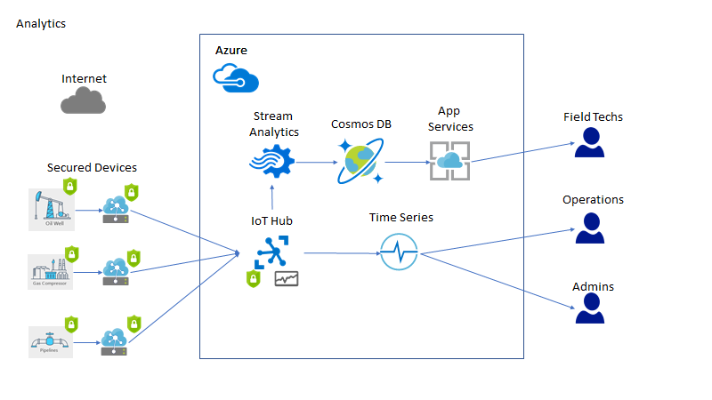

## Solution architecture (Data Processing)


## Solution architecture (Azure Sphere)


> **Note**: These labs focus solely on device security and do not explore analytics or data processing in depth. Stream Analytics and Service Bus are not presented in these labs. Additionally, you would need Azure Sphere hardware and connectivity to such devices in order to review full end to end (E2E) security components and topics such as highly secure remote upgrades. As such, you will not see these topics covered in these labs.

## Requirements

1. Microsoft Azure subscription must be pay-as-you-go or MSDN.

    - Trial subscriptions will not work.

## Before the hands-on lab

Refer to the Before the hands-on lab setup guide manual before continuing to the lab exercises.

> **Note**: As part of the deployment, both ports 3389 and 22 will be open on the Network Security Group.  It is advisable that you modify the NSG settings to only allow your internet IP to connect to those ports.
> **Note**: Previous versions of this lab used a previous version of IoT Edge (`<=1.09`), but has since been upgraded to use `1.2` or later.

## Exercise 1: Secure and configure IoT Hub and Device Provisioning Service

Duration: 15 minutes

In this exercise, you will link your provisioning service to your IoT Hub.  Once this is complete, you will enable the Azure Security Center for IoT on your IoT Hub.  With this plumbing in place, you can start creating your device enrollments and to provision your IoT devices.

You will also enable diagnostic logging such that you can create custom alerts later in this lab.

### Task 1: Link Device Provisioning Service to IoT Hub

1. Open the Azure Portal with your lab credentials.

2. Navigate to your lab Azure Resource Group.

3. Select the **oilwells-server-[YOUR INIT]** virtual machine.

4. Select **Connect**, then select **RDP**.

5. Login via RDP to the **oilwells-server-INIT** virtual machine with `wsuser` and password `S2@dmins2@dmin`.

6. While inside the virtual machine, open the Azure Portal as your lab credentials in Chrome.

7. Browse to your lab resource group.

8. Select the **oilwells-prov-[YOUR INITS]** device provisioning resource.

    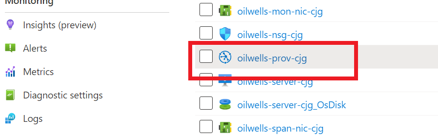

9. In the Device Provisioning Service blade, under **Settings**, select **Linked IoT Hubs**.

10. Select **+Add**.

    

11. Select the **oilwells-iothub-[YOUR INITS]** IoT Hub.

12. Select the **iotowner** access policy.

    

13. Select **Save**, your IoT Hub and Provisioning Service will now be linked.

### Task 2: Enable Azure Security Center for IoT

1. Navigate back to your resource group.

2. In the menu, select the **oilwells-iothub-[YOUR INITS]** IoT Hub.

3. In the resource blade, scroll down to the **Security** section and select **Overview**.

4. In the overview area, select **Secure your IoT solution**.

    

5. Press **F5** and refresh the Security Overview page of your IoT Hub, you should now see the **Threat prevention** and **Threat detection** KPIs.

6. In the blade navigation, under **Security**, select **Settings**.

    

7. On the settings page, select the **Data Collection** link.

8. Ensure **Enable Azure Defender for IoT** is selected.

9. Toggle the switch for the log analytics to **On**.

10. For the workspace, select **oilwells-logging-[YOUR INIT]**.

    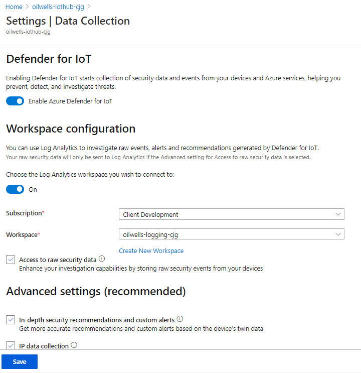

11. Select **Save**. Wait for the operation to complete.

### Task 3: Enable Azure Audit logging

1. Navigate back to your **iotsecurity-\[your initials or first name\]** resource group.

2. In the blade menu, select **Activity Log**.

3. Select the **Diagnostic settings** link.

4. Select your lab subscription.

5. Select the **Add diagnostic setting** link.

6. For the name, type **iotsecuritylogging**.

7. Under **Category details**, select all the checkboxes.

8. Select the **Send to Log Analytics** checkbox.

9. Select the **oilwells-logging-[YOUR INIT]**.

10. In the top menu, select **Save**. This action will send all Azure level configuration and diagnostic events to the Log Analytics workspace.

### Task 4: Configure diagnostic logging on IoT Hub

1. Navigate back to your resource group, select the **oilwells-iothub-[YOUR INIT]** IoT Hub.

2. In the blade menu, scroll to the **Monitoring** section, then select **Diagnostic settings**.

3. Select **Add diagnostic setting**.

    

4. For the name, type **oilwells-iothub-logging**.

5. Enable the **Send to Log Analytics** checkbox, and then select the **oilwells-logging-[YOUR INIT]** workspace.

6. Enable all the `log` checkboxes and the `metric` checkbox.

    

7. Select **Save**.

### Task 5: Configure diagnostic logging on Device Provisioning Service

1. Navigate back to your resource group, select the **oilwells-prov-[YOUR INIT]** IoT Device Provisioning Service.

2. In the blade menu, scroll to the **Monitoring** section, then select **Diagnostic settings**.

3. Select **Add diagnostic setting**.

4. For the name, type **oilwells-prov-logging**.

5. Enable the **Send to Log Analytics** checkbox, and then select the **oilwells-logging-[YOUR INIT]** workspace.

6. Enable all the LOG checkboxes.

7. Select **Save**.

>**Note**:  It may take 5-10 minutes for event data to populate into the Log Analytics and then for Security Center recommendations to display.

## Exercise 2: Enroll and provision IoT devices

Duration: 30 minutes

With the Azure resources in place, you can now start creating and provisioning devices into your Azure IoT Hub.  Here you will create several devices and configure them with the Azure IoT SDK, agents and modules to allow you to provision and utilize the security services offered by Azure.

### Task 1: Configure your devices

1. Inside the **oilwells-server-INIT** RDP session, open the Hyper-V console.

2. Select the **oilwells-edge-001** guest virtual machine.

    > **Note** It can take some time to download, unzip and mount the pre-created images so you may not see them show up immediately.

3. In the Hyper-V console, login to the VM using `wsuser` and password `S2@dmins2@dmin`

4. If prompted, select **Remind me Later** for upgrading the image.

5. Open a terminal window and run the following command:

    ```bash
    ifconfig
    ```

6. Record the `eth0` IP address.

    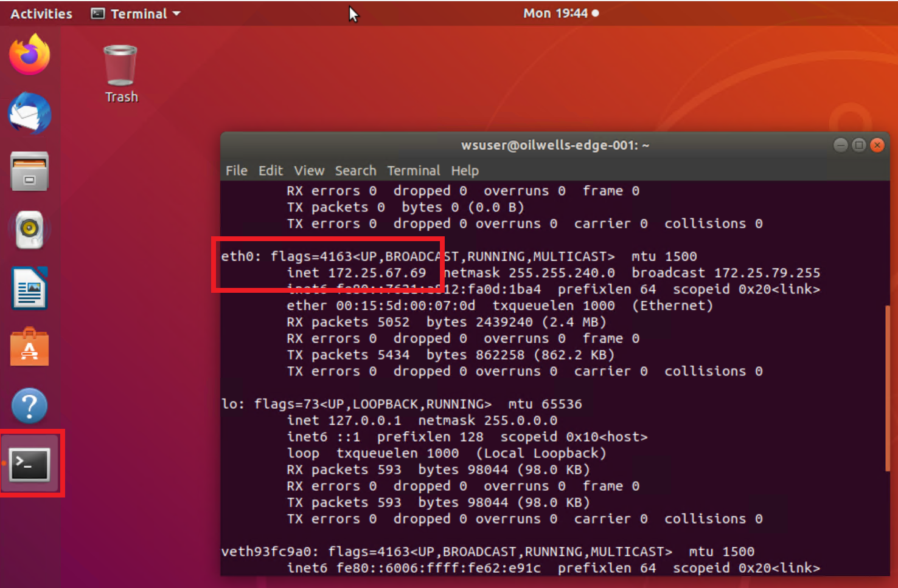

7. From the Windows 10 virtual machine host, open a PowerShell window and run the following:

    ```PowerShell
    ssh wsuser@{IP ADDRESS}
    ```

8. If prompted, type **yes**, then enter the password.

9. In the new SSH window, run the following commands. This could take up to 10 minutes to complete. You are updating and upgrading as some required packages will requires these updates.

    - Depending on your hosting environment and command line tool (cmd.exe, bash, PowerShell, etc.), you may need to run each line one at a time to avoid skipping any commands.

    - Again, depending on your hosting environment, you may find it easier to download and run these in a [Putty](https://the.earth.li/~sgtatham/putty/latest/w64/putty-64bit-0.73-installer.msi) session.

    - The following commands may take 20-30 minutes to complete.

    > **Note**: You may want to open the [MCW GitHub HOL](https://github.com/microsoft/MCW-Securing-Azure-IoT-solutions/blob/master/Hands-on%20lab/HOL%20step-by%20step%20-%20Securing%20Azure%20IoT%20solutions.md) document in the virtual machine to copy/paste the commands easier.

   - For Ubuntu 18.04 (Lab default), note that you may need to reboot during some of the steps:

       ```PowerShell
       sudo apt-get install -y git cmake build-essential curl

       sudo apt-get install -y libcurl4 libcurl4-openssl-dev libssl-dev uuid-dev
       
       sudo apt-get install -y auditd audispd-plugins
       ```

   - For Ubuntu 16.04:

       ```PowerShell
       sudo apt-get install -y git cmake build-essential curl libcurl4-openssl-dev libssl-dev uuid-dev

       sudo apt-get install -y libcurl3
       sudo apt-get install -y auditd audispd-plugins
       ```

   > **Note**: Ubuntu 20.04 will not work with these labs.

10. Repeat the steps above for the **oilwells-d01** guest virtual machine. In order to SSH into the child device `oilwells-d01`, you will need to enable SSH. Open the Hyper-V window for the `oilwells-d01`, login using the lab username and credentials, open a terminal and run the following:

    ```Powershell
    sudo apt-get install -y openssh-server

    sudo nano /etc/ssh/sshd_config
    ```

    - Uncomment the `PasswordAuthentication yes` line

    ```Powershell
    sudo systemctl stop ssh
    sudo systemctl start ssh
    ```

### Task 2: Download and compile the Azure IoT SDK

1. On both virtual machines (**oilwells-d01** and **oilwells-edge-001**), run the following commands:

    > **Note**: You can find the latest release of the Azure IoT SDK [here](https://github.com/Azure/azure-iot-sdk-c/releases).  You can open the git to see what the latest release tag is (we reference `LTS_07_2020` below), but be aware the remainder of the lab may not work properly based on a new release.

    ```PowerShell
    sudo chown -R $USER:$USER /home/wsuser
    sudo rm -rf /var/certs

    git clone https://github.com/Azure/iotedge --recursive

    sudo git clone -b LTS_07_2020_Ref01 https://github.com/Azure/azure-iot-sdk-c --recursive

    cd azure-iot-sdk-c

    git submodule update --init
    ```

    Determine if you have a hardware-based TPM by running the following and observing if you get any results back.

    ```bash
    dmesg | grep -i tpm
    ```

    These labs are using the latest Azure Windows 10 images and VM Compute. You should see the Microsoft Virtual TPM displayed.

    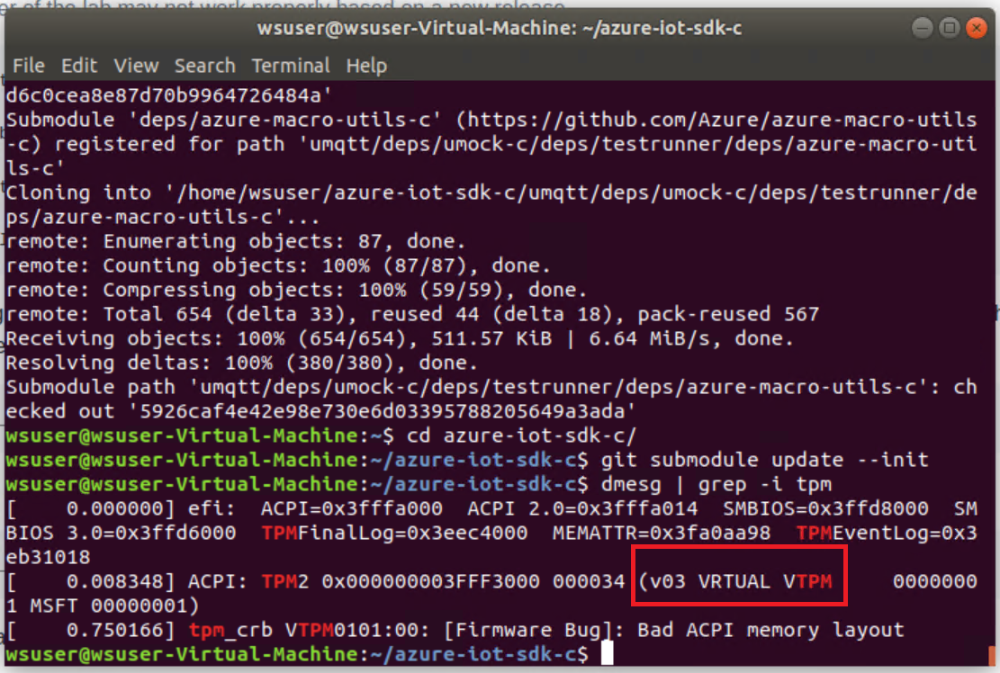

    If you are using a `hardware-based` image (which is the case with the pre-configured lab environment), then run the following command:

    ```PowerShell
    cmake -Duse_prov_client:BOOL=ON -Duse_tpm_simulator:BOOL=OFF .
    ```

    Otherwise with a `software-based` TPM, run the following:

    ```PowerShell
    cmake -Duse_prov_client:BOOL=ON -Duse_tpm_simulator:BOOL=ON .
    ```

    Whether software or hardware, setup the new registration and endorsement key tool by running the following:

    ```PowerShell
    cd provisioning_client/tools/tpm_device_provision

    make
    ```

### Task 3: Attempt device enrollment

1. On the `oilwells-edgevm-01` device, run the following commands:

    ```PowerShell
    sudo ./tpm_device_provision
    ```

    >**Note**:  This command will fail on a device that does not have a hardware or software TPM installed.  In order to utilize a hardware-based TPM, you would need an actual device with a TPM security chip, or a nested machine with a TPM enabled virtual machine running.  The Azure ARM template provisions an Azure VM Ubuntu image that does not have a hardware TPM enabled, nor does it have a software TPM installed.  However, the Windows 10 `server` image does have a Gen2 image setup that allows nested virtualization with a Hyper-V Virtual TPM installed.  As of 08/2021, a secured Azure Virtual Machine will surface as TPM, but it is not compatible with any of the current Azure IoT code/tools/software.

    

### Task 4: Install a software TPM and Resource Manager and reattempt device enrollment

 1. If you have a hardware TPM in your device the previous command would have succeeded and you can **skip to step 6**, again you can determine if you have a TPM device by running the following and observing if you get any results back.

    ```bash
    dmesg | grep -i tpm
    ```

    > **Note**: Devices such as a Raspberry PI do not come with a TPM chip.  You can however add a TPM chip to these devices such as [this Iridium Board](https://catalog.azureiotsolutions.com/details?title=OPTIGA-TPM-SLB-9670-Iridium-Board&source=all-devices-page/).

 2. Run the following commands to download, compile and start a software-based TPM server:

    ```PowerShell
    cd

    sudo wget -c https://phoenixnap.dl.sourceforge.net/project/ibmswtpm2/ibmtpm1332.tar.gz

    sudo tar -zxvf ibmtpm1332.tar.gz

    cd ..
    sudo chown -R $USER ~/.

    cd
    cd src
    sudo make

    ./tpm_server &
    ```

    > **Note**: Press Enter to continue entering commands.

    

 3. Run the following commands to start a TPM resource manager:

    ```PowerShell
    cd

    sudo apt-get install -y autoconf
    sudo apt-get install -y libtool
    sudo apt-get install -y pkg-config

    sudo wget -c https://netactuate.dl.sourceforge.net/project/ibmtpm20tss/ibmtss1.5.0.tar.gz

    sudo tar -zxvf ibmtss1.5.0.tar.gz

    cd ..
    sudo chown -R $USER ~/.

    cd

    sudo autoreconf -i
    ./configure --prefix=${HOME}/local --disable-hwtpm
    make
    make install

    cd local/bin
    ./tsspowerup &
    ./tssstartup &

    ```

    > **Note**: Press Enter after the tss commands to type more commands.

 4. With your hardware or software TPM running, attempt to provision again using the following commands:

    ```PowerShell
    cd
    cd azure-iot-sdk-c/provisioning_client/tools/tpm_device_provision
    sudo ./tpm_device_provision
    ```

    

 5. Copy the device **Registration Id** and the **Endorsement Key**.  Note that you may want to do this in the virtual machine rather than typing all the information.

    >**Note**: In the real world, all your devices should have hardware-based TPMs.

 6. Repeat the above steps on the **oilwells-d01** virtual machine in the Windows 10 host.

 7. In order to SSH into the child device, you will need to enable SSH. Switch to the Hyper-V for the `oilwells-d01` and run the following:

    ```Powershell
    sudo apt-get install -y openssh-server

    sudo nano /etc/ssh/sshd_config
    ```

    - Uncomment the `PasswordAuthentication yes` line

    ```Powershell
    sudo systemctl stop ssh
    sudo systemctl start ssh
    ```

### Task 5: Create IoT Hub Edge Device Enrollment

1. Switch to the Azure Portal and navigate to the **oilwells-prov-[YOUR INIT]** Device Provisioning Service.

2. Under **Settings**, select **Manage enrollments**.

3. Select **+Add Individual Enrollment**.

    

4. For the **Mechanism**, select **TPM**.

5. Enter your edge device Endorsement Key and Registration ID.

6. For the **IoT Hub Device ID**, type **oilwells-edge-001**.

    

7. Select the **True** toggle for the IoT Edge Device setting.

8. Select **Save**.

### Task 6: Create IoT Hub Device Enrollment

1. Repeat the previous steps to generate the registration ID and Key for the **oilwells-d01** guest virtual machine.

2. Switch to the Azure Portal and navigate to the **oilwells-prov-[YOUR INIT]** Device Provisioning Service.

3. Under **Settings**, select **Manage enrollments**.

4. Select **+Add Individual Enrollment**.

    

5. For the **Mechanism**, select **TPM**.

6. Enter your device Endorsement Key and Registration ID.

7. For the **IoT Hub Device ID**, type **oilwells-d01**.

8. Select the **False** toggle for the IoT Edge Device setting.

9. Select **Save**.

## Exercise 3: Install and configure IoT Edge

Duration: 30 minutes

In this exercise you will install the Azure IoT Edge agent on your IoT device and then register the new device with your IoT Hub.

>**Note**: You can download Ubuntu IoT Edge pre-installed virtual machine images in the Azure Marketplace.

### Task 1: Install IoT Edge

1. Switch back to your device terminal window for the **oilwells-edgevm-[YOUR INIT]** virtual machine, run the following command:

    >**Note**: Change the ubuntu version "os_version" as appropriate (`16.04` vs `18.04`).  You can get your version by running `lsb_release -a`.

    ```PowerShell
    cd

    curl https://packages.microsoft.com/config/ubuntu/{os_version}/multiarch/prod.list > ./microsoft-prod.list

    sudo cp ./microsoft-prod.list /etc/apt/sources.list.d/

    curl https://packages.microsoft.com/keys/microsoft.asc | gpg --dearmor > microsoft.gpg

    sudo cp ./microsoft.gpg /etc/apt/trusted.gpg.d/

    sudo apt-get update

    sudo apt-get install -y moby-engine
    ```

2. Choose **one of the agent paths** for your environment.  If you are new to the IoT Edge, then select the latest version path:

    `<=1.1.4`

    ```PowerShell
    sudo apt-get install iotedge
    ```

    `>=1.2`

    ```PowerShell
    sudo apt-get install aziot-edge
    ```

    > **Note**: Previous versions of this lab used a version of IoT Edge (`<=1.09`), but has since been upgraded to use `1.1.4` or later. The older path is included for reference.

### Task 2: Configure the IoT Edge agent

1. Switch to the Azure Portal, open your **oilwells-prov-[YOUR INIT]** device provisioning resource.

2. In the **Overview** blade, copy the **ID Scope**.

    

3. Navigate back to the resource group and open the **oilwells-iothub-[YOUR INIT]** IoT Hub.  

4. Under **Automatic Device Management**, select **IoT Edge**.

5. Select **+Add IoT Edge device**.

    

6. For the Device ID, type **oilwells-edge-001**.

    

7. Select **Save**.

    > **Note**: This step isn't necessary as the device provisioning service would create the device in the IoT Hub, but for the ease of flow of the lab, it is completed here.

8. Select the new **oilwells-edge-001** item, copy the primary key and primary device connection strings.

    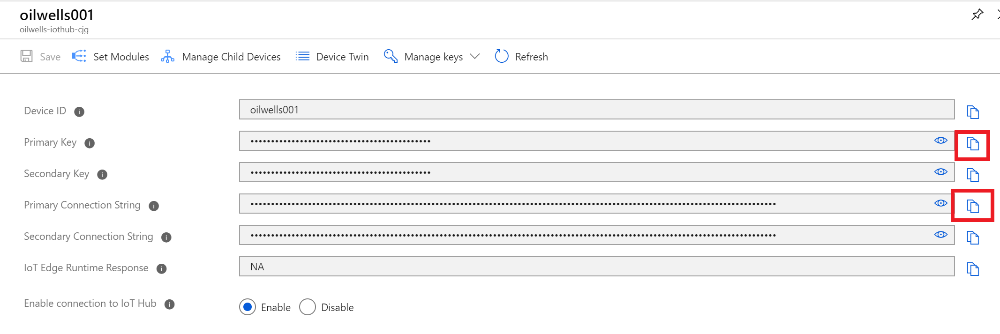

9. Switch back to your terminal window or SSH shell, run the following command to open a text editor:

    `<=1.1.4`

    ```PowerShell
    sudo nano /etc/iotedge/config.yaml
    ```

    `>=1.2`

    ```PowerShell
    sudo cp /etc/aziot/config.toml.edge.template /etc/aziot/config.toml

    sudo nano /etc/aziot/config.toml
    ```

10. Uncomment the line and edit the host name to be `oilwells-edge-001`.

11. There are several ways to register your device with the provisioning service.  This includes manually with a device connection string, TPM registration, and symmetric key.  

    The simplest provisioning method is "manual" with a device connection string.  Each way is presented below, you need **only pick one**.  Note that TPM registration requires a software or hardware TPM.  As of 08/2021, Trusted Platform in Azure will not work, but a nested VM inside a Hyper-V image (in the case of this lab, inside Windows 10) does and **TPM is the method you should choose**.

    >**Note**: YAML file structure formats are very specific.  Be sure that the leading lines have "tabs" that are made up of only 2 space characters.

    - Manual Provisioning

        - Using the device connection string you copied from above, paste it into the `config.yaml` or `config.toml` file:

        - `<=1.1.4`

            

        - `>=1.2.0`

            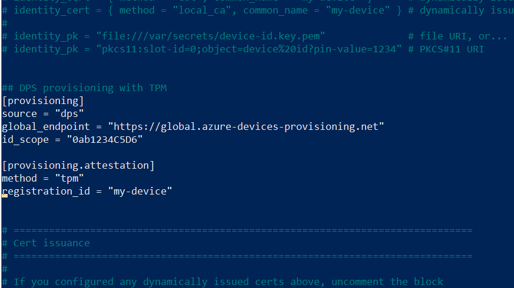

        - Save the file, press **CTRL-X**, then **Y**, then **Enter**.

    - Symmetric Key Provisioning

        - Comment out the manual provision settings, uncomment the **DPS symmetric key** settings, then copy in the device primary symmetric key (you will have to change the device registration to this type) and Registration ID information.

        - Save the file, press **CTRL-X**, then **Y**, then **Enter**.

    - Certificate Provisioning

        - You will need to generate a test CA certificate and then device certificates.

        - On the `server-INIT` virtual machine, open a PowerShell  window, run the following.  Be sure to replace the IoT Hub name:

            ```PowerShell

            #https://github.com/Azure/azure-iot-sdk-c/blob/master/tools/CACertificates/CACertificateOverview.md

            #https://docs.microsoft.com/en-us/azure/iot-hub/iot-hub-x509ca-overview#sign-devices-into-the-certificate-chain-of-trust

            mkdir "c:\certs" -ea silentlycontinue

            cd "c:\certs"

            . "C:\LabFiles\azure-iot-sdk-c\tools\CACertificates\ca-certs.ps1"

            Test-CACertsPrerequisites

            #create the CA
            New-CACertsCertChain "rsa"

            $secPassword = ConvertTo-SecureString -String "S2@dmins2@dmin" -AsPlainText -Force;

            #create the device certs (oilwells-edge-001, oilwells002)
            New-CACertsEdgeDevice "oilwells-edge-001" -certPassword $secpassword

            Write-CACertsCertificatesForEdgeDevice "oilwells-edge-001"

            New-CACertsDevice "oilwells-d01" -certPassword $secpassword

            Write-CACertsCertificatesToEnvironment "oilwells-d01" {myIotHubName}

            New-CACertsDevice "oilwells-d02" -certPassword $secpassword

            Write-CACertsCertificatesToEnvironment "oilwells-d02" {myIotHubName}
            #>
            ```

    - TPM Provisioning

        - Comment out the manual provision settings, uncomment the **dps TPM** settings, then copy in the ID Scope and Registration ID information:

            

        - Although we are using a software TPM, when using a hardware TPM, you would need to give permissions to the hardware TPM to the iotedge service by running the following commands:

        - Save the file, press **CTRL-X**, then **Y**, then **Enter**.

        ```PowerShell
        tpm0=$(sudo find /sys -name dev -print | fgrep tpm0 | sed 's/.\{4\}$//')
        tpmrm0=$(sudo find /sys -name dev -print | fgrep tpmrm0 | sed 's/.\{4\}$//')

        sudo touch /etc/udev/rules.d/tpmaccess.rules
        ```

        - Run the following command to open a text editor:

        ```PowerShell
        sudo nano /etc/udev/rules.d/tpmaccess.rules
        ```

        - Replace the file with the following lines and then save the file:

        `<=1.1.4`

        ```PowerShell
        # allow iotedge access to tpm0
        KERNEL=="tpm0", SUBSYSTEM=="tpm", OWNER="iotedge", GROUP="iotedge", MODE="0660"
        KERNEL=="tpmrm0", SUBSYSTEM=="tpmrm", OWNER="iotedge", GROUP="iotedge", MODE="0660"
        ```

        `>=1.2`

        ```PowerShell
        # allow iotedge access to tpm0
        KERNEL=="tpm0", SUBSYSTEM=="tpm", OWNER="aziottpm", GROUP="aziottpm", MODE="0660"
        KERNEL=="tpmrm0", SUBSYSTEM=="tpmrm", OWNER="aziottpm", GROUP="aziottpm", MODE="0660"
        ```

        - Execute the following:

        ```PowerShell
        /bin/udevadm trigger $tpm0
        /bin/udevadm trigger $tpmrm0
        ```

        - Reboot the device/machine.

        ```PowerShell
        sudo reboot
        ```

        - Login and re-open the terminal.
        - Check that access has been applied:

        ```bash
        ls -l /dev/tpm0
        ls -l /dev/tpmrm0
        ```

        - You should see something similar to the following, ensure that `iotedge` or `aziottpm` is displayed depending on your IoT Edge version:

        ```bash
        crw-rw---- 1 iotedge iotedge 10, 224 Jul 20 16:27 /dev/tpm0
        ```

12. After completing **one** of the above methods, run the following commands to restart the iotedge service:

    - `<=1.1.4`

        ```bash
        sudo systemctl restart iotedge
        sudo systemctl status iotedge
        ```

        You should see the iotedge client status as **active (running)**.  Press **Ctrl-C** to exit the status message.

        

        > **Note**: If you do not see **active (running)**, then run the following command to see diagnostics logs that may help you troubleshoot the issue:

        ```PowerShell
        sudo journalctl -u iotedge -e
        ```

    - `>=1.2`

        ```bash
        sudo iotedge config apply

        sudo iotedge system status
        ```

        You should see the iotedge services all display **Running**.

        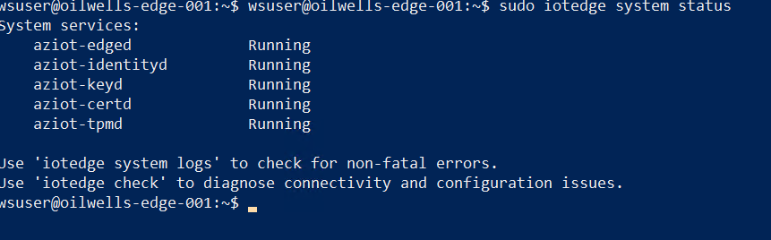

        > **Note**: If you do not see **active (running)**, then run the following command to see diagnostics logs that may help you troubleshoot the issue:

        ```PowerShell
        sudo iotedge check
        ```

13. After the above configurations, the IoT Edge modules will be downloaded and created in docker containers. You can review the docker images by running the following command (it may take a few minutes for them to initialize on first start):

    ```PowerShell
    sudo docker ps
    ```

    

## Exercise 4: Install Azure Security IoT agent

Duration: 15 minutes

In this exercise you will install the Azure Security IoT Agent directly and via an Azure IoT Edge module.

### Task 1: Install the Security agent

1. Switch to the **oilwells-edge-001** IoT Edge Device SSH window.

2. Run the following to create the key file.

    ```PowerShell
    sudo mkdir /var/certs

    sudo nano /var/certs/key
    ```

3. Copy the primary key for the device from the IoT Hub in the Azure Portal and paste it into the `/var/certs/key` file.

4. Run the following commands, be sure to replace the ubuntu version.

    >**Note**: Change the ubuntu version "os_version" as appropriate (`16.04` vs `18.04`).  You can get your version by running `lsb_release -a`.

    ```bash
    cd

    git clone https://github.com/Azure/Azure-IoT-Security-Agent-C.git --recursive

    sudo apt-get install -y auditd audispd-plugins

    #create release folder
    cd Azure-IoT-Security-Agent-C
    sudo mkdir release
    cd release

    #download the release binaries

    sudo wget -c https://github.com/Azure/Azure-IoT-Security-Agent-C/releases/download/0.0.5/ubuntu-{os_version}-x64.tar.gz

    #extract the release binaries
    sudo tar -zxvf ubuntu-{os_version}-x64.tar.gz

    #copy to target folder
    sudo cp -r Install/. /var/ASCIoTAgent

    cd /var/ASCIoTAgent

    sudo chmod +x InstallSecurityAgent.sh

    #BE SURE TO REPLACE WITH YOUR INIT
    sudo ./InstallSecurityAgent.sh -aui Device -aum SymmetricKey -f /var/certs/key -hn oilwells-iothub-[YOURINIT].azure-devices.net -di oilwells-edge-001 -i
    ```

    > **Note**: The device ID is case-sensitive. Be sure you specify the correct device ID or the service will not start.

5. Run the following command to start the security agent:

    ```PowerShell
    sudo systemctl start ASCIoTAgent
    sudo systemctl status ASCIoTAgent
    ```

6. The status of the service will not be **started**.  Run the following command:

    ```PowerShell
    sudo journalctl -u ASCIoTAgent -e
    ```

7. Scroll to the bottom of the logs, you should see an error about the azureiotsecurity module not being registered.

    

### Task 2: Install the IoT Hub Security Agent Module

1. Switch to the Azure Portal.

2. Open the **oilwells-iothub-[YOUR INIT]** IoT Hub.

3. Under **Automatic Device Management**, select **IoT Edge**.

4. Select the **oilwells-edge-01** device.

5. In the top nav menu, select **Set Modules**.

    

6. Select **+Add**, then select **IoT Edge Module**.

    

7. In the new dialog, for the **IoT Edge Module Name**, type **azureiotsecurity**.

8. For the Image URI, type:

    ```text
    mcr.microsoft.com/ascforiot/azureiotsecurity:1.0.2
    ```

    

9. Select the **Container Create Options** tab, copy and paste the following:

    ```json
    {
        "NetworkingConfig": {
            "EndpointsConfig": {
                "host": {}
            }
        },
        "HostConfig": {
            "Privileged": true,
            "NetworkMode": "host",
            "PidMode": "host",
            "Binds": [
                "/:/host"
            ]
        }
    }
    ```

10. Select the **Module Twin Settings** tab, copy and paste the following into the twin's desired properties text area:

    ```json
    {
        "azureiot*com^securityAgentConfiguration^1*0*0": {
        }
    }
    ```

11. Select **Add**.

12. Select **Runtime settings**.

13. In the **Edge Agent** section, change the image name to **mcr.microsoft.com/azureiotedge-agent:1.1**, then select **Apply**.

14. In the **Edge Hub** section, change the image name to **mcr.microsoft.com/azureiotedge-hub:1.1**, then select **Apply**.

15. Select **Next: Routes>**.

16. On the routes dialog, add another route called `ASCForIoTToIoTHub` with the value `FROM /messages/modules/azureiotsecurity/* INTO $upstream`:

    

17. Select **Review + create**.

18. Select **Create**.

19. Switch back to your terminal\SSH session, then run the following command to start the security agent:

    ```PowerShell
    sudo systemctl restart ASCIoTAgent
    sudo systemctl status ASCIoTAgent
    ```

20. The status should now show **active (running)**.

    

21. If you do not see **active (running)** you may need to change your docker permissions:

    ```PowerShell
    sudo groupadd docker

    sudo usermod -aG docker $USER

    newgrp docker

    ```

22. If still not started, run the following command and attempt to debug any issues:

    ```PowerShell
    sudo journalctl -u ASCIoTAgent -e
    ```

## Exercise 5: Microsoft Defender for Endpoint (Linux) - (Optional)

This optional exercise requires you to configure and enable Microsoft Defender for Endpoint in your tenant which is outside the scope of this workshop/lab.

### Task 1: Install the Microsoft Defender for Endpoint Agent

1. Switch to the **oilwells-edge-01** device, run the following commands, be sure to replace `{os_version}`:

    ```PowerShell
    cd

    sudo apt-get install curl

    sudo apt-get install libplist-utils

    sudo apt-get install gpg

    sudo apt-get install apt-transport-https
    
    sudo apt-get install mdatp
    ```

2. Switch to the [Microsoft Defender Portal](https://security.microsoft.com).

3. Select **Settings**.

4. Select **Endpoints**.

    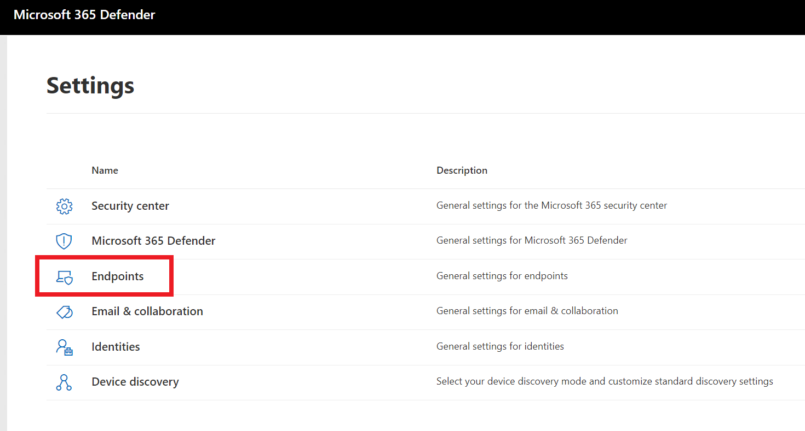

5. Under **Device management**, select **Onboarding**.

6. In the dropdown, select **Linux Server**.

7. Select **Download onboarding package** to download the zip package.  Once it is downloaded, unzip it.

    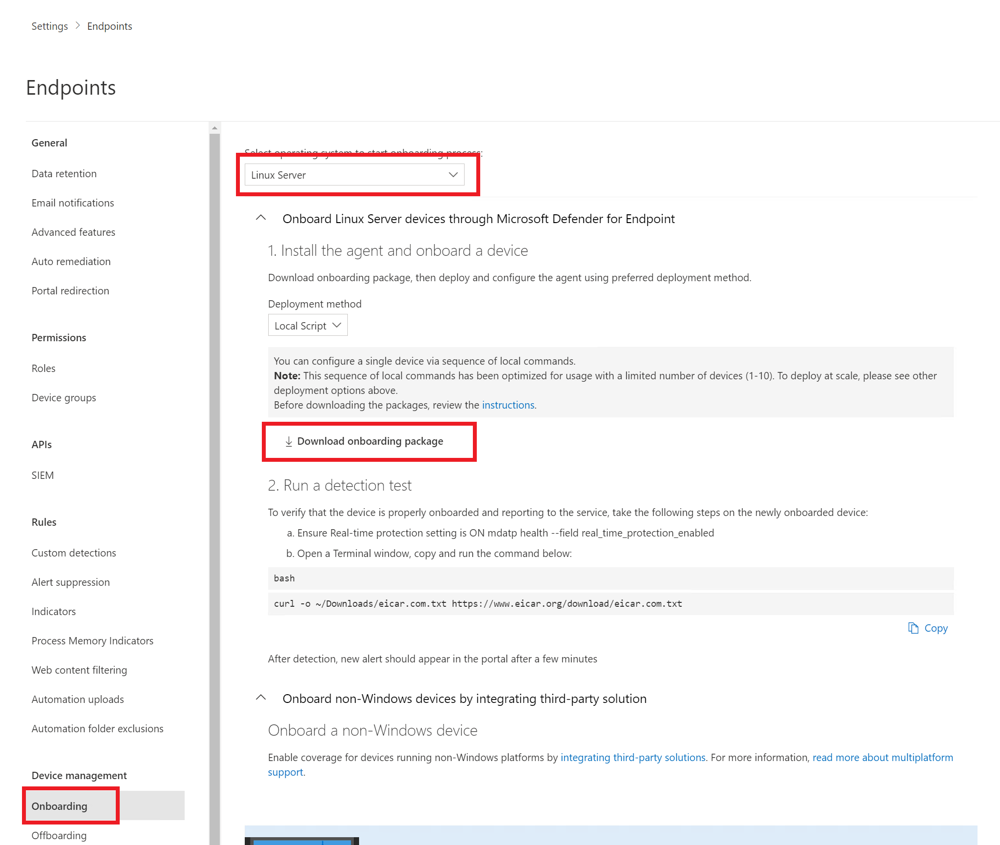

8. Open the `MicrosoftDefenderATPOnboardingLinuxServer.py` file, copy its contents to your IoT Device:

    ```PowerShell
    sudo nano MicrosoftDefenderATPOnboardingLinuxServer.py
    ```

9. Run the following commands to configure the agent:

    ```PowerShell
    sudo apt-get install python
    
    python MicrosoftDefenderATPOnboardingLinuxServer.py
    ```

10. Verify it is running:

    ```PowerShell
    mdatp health --field real_time_protection_enabled
    ```

## Exercise 6: Setup Device to Edge Device Communication

Duration: 30 minutes

In this exercise you will setup a device to edge device communication channel.

### Task 1: Create Device Certificates

1. Switch to the **oilwells-edge-01** device SSH session.
2. Run the following commands:

    ```Powershell
    cd 

    #git clone https://github.com/Azure/iotedge.git

    cp iotedge/tools/CACertificates/*.cnf .
    cp iotedge/tools/CACertificates/certGen.sh .

    ./certGen.sh create_root_and_intermediate

    ./certGen.sh create_edge_device_identity_certificate "oilwells-edge-001"

    ./certGen.sh create_edge_device_ca_certificate "oilwells-ca"

    ./certGen.sh create_device_certificate "oilwells-d01-primary"
    ./certGen.sh create_device_certificate "oilwells-d01-secondary"
    ```

### Task 2: Upload and Verify Root CA to IoT Hub

1. Run the following command:

    ```PowerShell
    sudo nano /home/wsuser/certs/azure-iot-test-only.root.ca.cert.pem
    ```

2. Copy the text in the file to a machine that can be used to upload via browser.
3. Switch to the Azure Portal, browse to the IoT Hub.
4. Under **Settings**, select **Certificates**.
5. Select **Add**.

    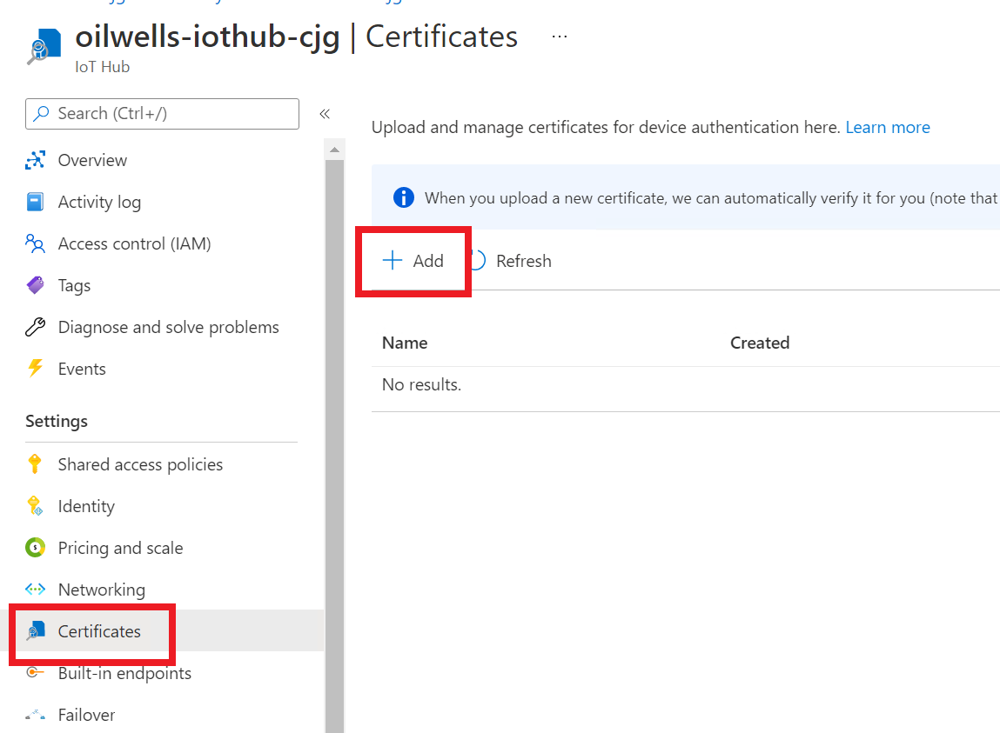

6. For the name, type **oilwells-ca**.
7. Select the .pem file.
8. Select **Save**.
9. Select the new certificate, then select **Generate verification code**.

    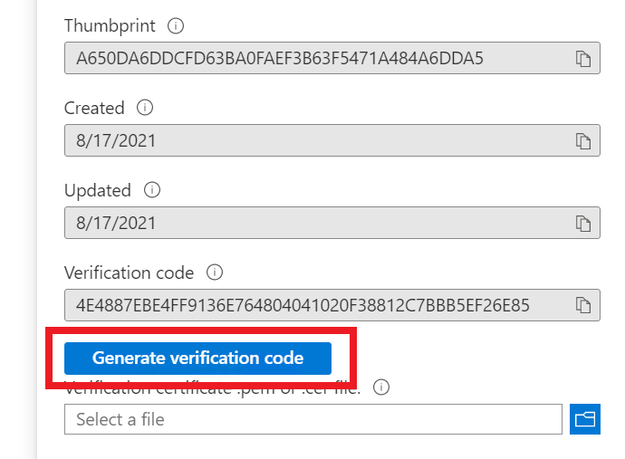

10. Copy the verification code and run the following in the SSH session:

    ```PowerShell
    ./certGen.sh create_verification_certificate "<verification code>"

    ./certGen.sh create_device_certificate "oilwells-d01"
    ```

11. Run the following, again copy the text into a file that can be used to upload.

    ```PowerShell
    sudo nano /home/wsuser/certs/iot-device-verification-code-full-chain.cert.pem
    ```

12. In the Azure Portal, select to upload the new verification certificate.
13. Select **Verify**, you should now see the certificate is verified.

    

14. In the `oilwells-edge-001` SSH session, run the following command to copy the certs to the child device `oilwells-d01`, be sure to replace the `{DEVICE_IP}` value:

    ```PowerShell
    scp -r /home/wsuser/certs wsuser@{DEVICE_IP}:/home/wsuser
    scp -r /home/wsuser/private wsuser@{DEVICE_IP}:/home/wsuser
    ```

    >**Note** In production you would not copy all of these files to a downstream device.

### Task 3: Setup Edge Device

1. Run the following commands to update the certificates on both devices `oilwells-edge-001` and `oilwells-d01`:

    ```PowerShell
    sudo cp /home/wsuser/certs/azure-iot-test-only.root.ca.cert.pem /usr/local/share/ca-certificates/azure-iot-test-only.root.ca.cert.pem.crt
    sudo update-ca-certificates
    ```

2. On the `oilwells-edge-001` device, run the following to edit the IoT Edge configuration:

    - `<=1.1.4`

        ```PowerShell
        sudo nano /etc/iotedge/config.yaml
        ```

        - Uncomment and update the `X.509` section by uncommenting the lines.  Set the values to the following:

        ```PowerShell
        certificates;
        device_ca_cert: "/home/wsuser/certs/iot-edge-device-identity-oilwells-edge-001-full-chain.cert.pem"
        device_ca_pk: "/home/wsuser/private/iot-edge-device-identity-oilwells-edge-001.key.pem"
        trusted_ca_certs: "/home/wsuser/certs/azure-iot-test-only.root.ca.cert.pem"
        ```

   - `>=1.2`

        ```PowerShell
        sudo nano /etc/aziot/config.toml
        ```

       - Uncomment and update the values and section by uncommenting the lines and setting the values to the following:

        ```PowerShell
        trust_bundle_cert = "file:///home/wsuser/certs/azure-iot-test-only.root.ca.cert.pem"
        ```

        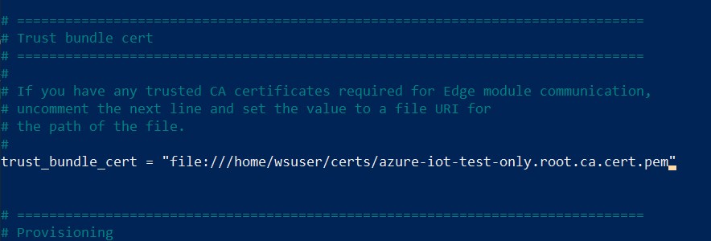

        ```PowerShell
        [edge_ca]
        cert = "file:///home/wsuser/certs/iot-edge-device-identity-oilwells-edge-001-full-chain.cert.pem"                
        pk = "file:///home/wsuser/private/iot-edge-device-identity-oilwells-edge-001.key.pem"             
        ```

        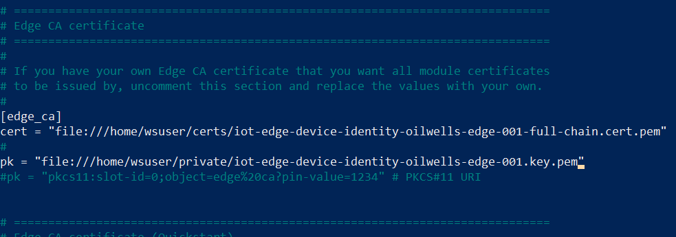

3. Save and close the file.
4. Run the following to restart the IoT Edge service:

    - `<=1.1.4`

    ```PowerShell
    sudo systemctl restart iotedge
    ```

    - `>=1.2`

    ```PowerShell
    sudo iotedge config apply
    ```

5. Be sure to open the firewall ports:

    ```bash
    sudo ufw allow 8883/tcp
    ```

6. If you have issues, run the following:

    - `<=1.1.4`

    ```PowerShell
    sudo journalctl -u iotedge
    ```

    - `>=1.2`

    ```PowerShell
    sudo iotedge system status
    ```

7. When running your IoT Edge device in Azure, you would need to open up NSG port access:

   - Switch to the Azure Portal.
   - Browse to your lab resource group.
   - Select the **oilwells-nsg-INIT** network security group.
   - Select **Inbound Security Rules**, then select **Add**.
   - For the destination port, type **8883**.
   - For the name, type **Port_8883**.
   - Select **Apply**.

### Task 4: Setup Device

1. Switch to the **oilwells-d01** device SSH session.

2. Run the following commands to get the SHA1 fingerprints on the device cert files:

    ```PowerShell
    cd certs

    openssl x509 -in iot-device-oilwells-d01-primary.cert.pem -text -fingerprint | sed 's/[:]//g'
    
    openssl x509 -in iot-device-oilwells-d01-secondary.cert.pem -text -fingerprint | sed 's/[:]//g'
    ```

3. Record each of the fingerprints, then switch to the Azure Portal.
4. Browse to the IoT Hub.
5. Under **Explorers**, select **IoT devices**.
6. Select **+Add device**.
7. For the **Device ID**, type **oilwells-d01**
8. For the authentication type, select **X.509 Self Signed**.
9. Paste the primary and secondary fingerprints you records above.
10. Select **Set a parent device**.
11. Select the **oilwells-edge-001** device.
12. Select **OK**.
13. Select **Save**.

14. Switch to the `oilwells-d01` device, run the following command to open the HOSTS file:

    ```PowerShell
    sudo nano /etc/hosts
    ```

15. Add the following to the hosts file, be sure to replace `EDGE_IP`:

    ```text
    {EDGE_IP} oilwells-edge-001
    ```

16. Test the various connections:

    ```PowerShell
    openssl s_client -connect oilwells-edge-001:8883 -CAfile /home/wsuser/certs/azure-iot-test-only.root.ca.cert.pem -showcerts

    openssl s_client -connect oilwells-edge-001:443 -CAfile /home/wsuser/certs/azure-iot-test-only.root.ca.cert.pem -showcerts

    openssl s_client -connect oilwells-edge-001:5671 -CAfile /home/wsuser/certs/azure-iot-test-only.root.ca.cert.pem -showcerts
    ```

17. You should receive a response with all the certificate information:

    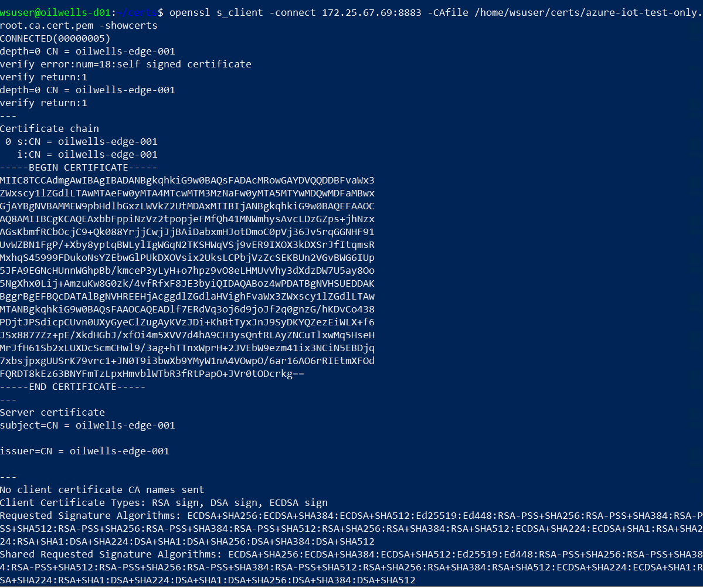

### Task 5: Test Device to Edge Device Application Communication (Optional)

1. In the `oilwells-d01` SSH session, download the IoTEdgeAndMISample project:

    ```PowerShell
    sudo apt-get install -y git curl

    git clone https://github.com/Azure/iotedge --recursive
    ```

2. Install DotNet 3.1:

    ```PowerShell
    sudo snap install dotnet-sdk --classic --channel=3.1
    ```

3. Compile the project:

    ```PowerShell
    cd iotedge/samples/dotnet/EdgeX509AuthDownstreamDevice

    sudo dotnet build 
    ```

4. Run the following to edit the configuration file:

    ```PowerShell
    sudo nano Properties/launchSettings.json
    ```

5. Set the `IOTHUB_HOSTNAME` to **oilwells-iothub-INIT.azure-devices.net**.

6. Set the `IOTHUB_GATEWAY_HOSTNAME` to **oilwells-edge-001**.

7. Set the `DEVICE_ID` and set it to **oilwells-d01**.

8. Set the `DEVICE_IDENTITY_X509_CERTIFICATE_PEM_PATH` and set it to **/home/wsuser/certs/iot-device-oilwells-d01-primary-full-chain.cert.pem**.

9. Set the `DEVICE_IDENTITY_X509_CERTIFICATE_KEY_PEM_PATH` and set it to **/home/wsuser/private/iot-device-oilwells-d01-primary.key.pem**.

10. Set the `IOTEDGE_TRUSTED_CA_CERTIFICATE_PEM_PATH` to **/home/wsuser/certs/azure-iot-test-only.intermediate-full-chain.cert.pem**

11. Run the program:

    ```PowerShell
    sudo dotnet run
    ```

12. You should see the messages flow from the device to the edge device:

    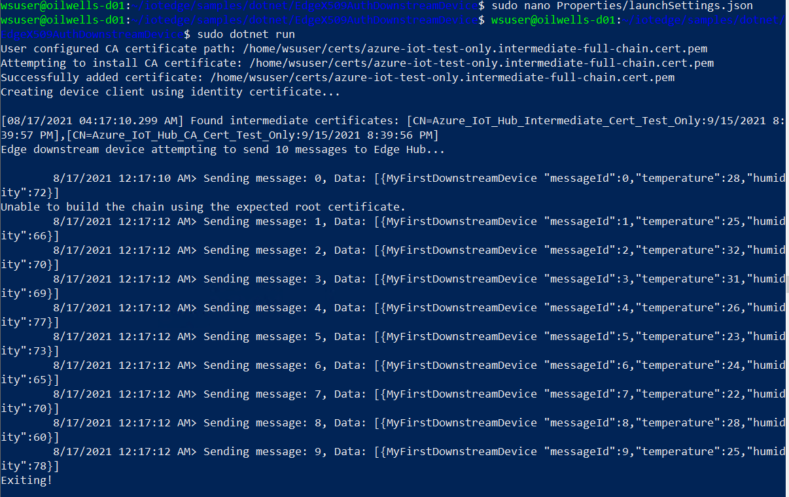

<!--
### Maybe for later???

### Task 5: Setup Child Edge Device to Parent Edge Device Heirarchy (Optional)

1. Run the following command to open the config file

    ```PowerShell
    sudo nano /etc/iotedge/config.yaml
    ```

2. Change the authentication to be a manual connection string

3. Set the connection string to the following, be sure to replace the `INIT`:

    ```text
    HostName=oilwells-iothub-INIT.azure-devices.net;DeviceId=oilwells-d01;x509=true;GatewayHostName=oilwells-edge-001
    ```

-->

## Exercise 7: Simulate IoT attacks

Duration: 10 minutes

This exercise will have you install some "fake" processes and open some non-standard ports on your IoT device.  Once your attacks have been executed, the Security Agent will pick up these bad configurations and send them to the IoT Hub and the Azure Security Center will notify you.

### Task 1: Setup and execute attack scripts

1. Run the following command:

    ```bash
    sudo apt-get install -y netcat
    ```

2. Download and execute the attack script:

    ```bash
    cd

    git clone https://github.com/Azure/Azure-IoT-Security --recursive

    cd Azure-IoT-Security/trigger_events

    sudo chmod +x trigger_events.sh

    sudo ./trigger_events.sh --exploit

    sudo ./trigger_events.sh --malicious
    ```

    > **Note**: Feel free to explore the trigger events scripts and its different options : <https://github.com/Azure/Azure-IoT-Security/tree/master/trigger_events>.

3. Run the following commands to test malware protection:

    ```PowerShell
    curl -o /tmp/eicar.com.txt https://www.eicar.org/download/eicar.com.txt
    ```

4. Run the following to see if it was caught:

    ```PowerShell
    mdatp threat list
    ```

### Task 2: Configure Azure Agent

1. In the Azure Portal, browse to your **iotsecurity-INIT** resource group, then select the **oilwells-logging-INIT** Log Analytics Workspace.

2. In the blade, select **Agents Management**.

3. Record the `Workspace ID` and the `Primary key` values.

4. In the **oilwells-edge-001** and **oilwells-d01** virtual machines, run the following commands, be sure to replace the workspace tokens with the values you records above:

    ```bash
    cd

    wget https://raw.githubusercontent.com/Microsoft/OMS-Agent-for-Linux/master/installer/scripts/onboard_agent.sh && sh onboard_agent.sh -w <YOUR_WORKSPACE_ID> -s <YOUR_WORKSPACE_KEY>

    sudo /opt/microsoft/omsagent/bin/service_control restart <YOUR_WORKSPACE_ID>

    ```

5. Switch back to the Azure Portal.

6. In the blade menu, select **Agents Management** and then select **Linux Servers**, after some time, you should see **2 LINUX COMPUTER CONNECTED**.

    > **Note**: It may take a few minutes for the OMS logs to show up and a heartbeat to be registered in Log Analytics for the IoT Linux machine.

### Task 3: Perform brute force attack

1. In the **oilwells-server-[YOUR INIT]** Windows 10 virtual machine, open a new PowerShell ISE window.

2. Browse to the `\Hands-on-lab\Scripts\BruteForce.ps1` script from this lab repo.

3. Update the script with the Hyper-V assigned IP address of the **oilwells-edge-001** device. You can get the IP by running `ifconfig`.

4. Press **F5** to run the script. The script will attempt to login to the IoT device using the wrong credentials with the plink tool of Putty.

    > **Note**: If the putty version has changed, the script will need to be updated. Browse to [here](https://the.earth.li/~sgtatham/putty/0.74/w64/) to find the latest version.

5. Eventually Azure Security Center will send an email warning of a brute force attack on your IoT Device.

    - Browse to the IoT Hub then under the Security section, select **Alerts**.

    - You should see the brute force alert displayed.

    

## Exercise 8: Configure security and alerts

Duration: 20 minutes

This exercise will evaluate the logs from when you enabled diagnostic logging on your Azure resources and then setup some alerts based on any important configuration changes that an Azure user may make to your IoT infrastructure.  You will also setup a baseline such that if a local user makes a change on your IoT Device, the security agent will make note of it and notify you.

### Task 1: Create IoT Baseline checks

1. Switch to the Azure Portal and your lab resource group.

2. Select the **oilwells-iothub-[YOUR INIT]** IoT Hub.

3. Under **Automatic Device Management**, select **IoT Edge**.

4. Select the **oilwells-edge-001** device.

5. Select the **azureiotsecurty** module.

6. Select the **Module Identity Twin** tab.

7. Find the `desired` section of the twin, add the `ms_iotn:urn_azureiot_Security_SecurityAgentConfiguration` property with the following:

    ```json
        "ms_iotn:urn_azureiot_Security_SecurityAgentConfiguration": {
            "baselineCustomChecksEnabled": {
            "value" : true
            },
            "baselineCustomChecksFilePath": {
            "value" : "/home/wsuser/oms_audits.xml"
            },
            "baselineCustomChecksFileHash": {
            "value" : "9026e50c728fe00edcc9d46f2cdb3346425931889730cbf970ccb368dfa2296e"
            }
        }
    ```

    > **Note**: You can use the [sha256sum](https://linux.die.net/man/1/sha256sum) tool in Linux to create a file hash.

    

8. Select **Save**.

9. Switch to your terminal/SSH/putty session connected to the **oilwells-edge-001** IoT Device, run the following commands:

    ```bash
    sudo nano /home/wsuser/oms_audit.xml
    ```

10. Copy and paste the local `/Hands-on lab/scripts/oms_audits.xml` or [remote](../Hands-on%20lab/Scripts/oms_audits.xml) file content into the session window, then save it.

### Task 2: Review Azure Security for IoT log data

1. Switch to the Azure Portal and your resource group.

2. Select the **oilwells-iothub-[YOUR INIT]** IoT Hub.

3. In the blade menu, in the **Security** section, select **Overview**, you will get a dashboard of potential security recommendations you should consider.

4. Under **Security**, select **Security Alerts**, you should see several alerts displayed.

5. Under **Security**, select **Recommendations**, you should see our attack items displayed.

    

    >**Note**: It may take 10-15 minutes for them to be displayed.

6. Select the **Device has open ports** recommendation.  In the dialog, select the **To see which devices have this recommendation...** link.  This will navigate to the Log Analytics portal when you can drill deeper into the log data that caused the alert.

7. Expand the log.

### Task 3: Create custom security alerts for device events

1. From the **oilwells-iothub-[YOUR INIT]** IoT Hub blade, in the **Security** section, select **Settings**, then select **Custom Alerts**.

2. Select the **default** security group.

3. Select **Create custom alert rule**.

    

4. Review the available options, then select **Number of failed local logins is not in allowed range**.

    

5. Select **OK**.

6. Select **Save**.  In addition to the custom alerts you can create, you will also see default ones fire such as successful logins.

    

### Task 4: Create custom security alerts for azure events

1. From the Azure Portal navigate back to your resource group, then select the **oilwells-logging-[YOUR INIT]** Log Analytics instance.

2. In the blade menu, in the **General** section, select **Logs**. If displayed, select **Get Started**, then dismiss the **Queries** dialog window.

    

3. In the query window, paste the following:

    ```SQL
    AzureActivity
    | where Resource == "oilwells-iothub-[YOUR INIT]"
    | limit 50
    | sort by TimeGenerated desc
    ```

4. Select **Run**, you may not see any results.

    

5. In the top navigation menu, select **+New alert rule**.

6. Select the condition, in the dialog, scroll to the **threshold value**, type **1**, select **Done**.

    

7. Select the **Add action groups** link, then select **Create action group**.

8. Select the **iotsecurity-\[your initials or first name\]** resource group.

9. For the action group name type **Email IoT Hub Admins**.

10. For the display name type **Email**.

11. Select **Next: Notifications**.

12. For the action type, select **Email/SMS Message/Push/Voice**.

13. For the action name, type **Email IoT Hub Admins**.

14. In the dialog that opens, check the **Email** checkbox, then type an email alias.

15. Select **OK**.

16. Select **Review + create**.

17. Select **Create**.

18. For the **Alert rule name**, type **IoT Hub Modified**.

19. For the **description**, type **The IoT Hub was modified**.

    

20. Select **Create alert rule**.

21. Make a change to your IoT Hub such as adding a user as an owner. You will receive an email alert after a few minutes notifying you of the change.

    

22. From the Azure Portal navigate back to your resource group, then select the **oilwells-logging-[YOUR INIT]** Log Analytics workspace instance.

23. In the blade menu, in the **General** section, select **Logs**.

24. In the query window, paste the following:

    ```SQL
    AzureDiagnostics
    | where ( ResourceType == "IOTHUBS" and Category == "Connections" and Level == "Error")
    ```

    - Common connection errors include:

        - [404104 DeviceConnectionClosedRemotely](https://docs.microsoft.com/en-us/azure/iot-hub/iot-hub-troubleshoot-error-404104-deviceconnectionclosedremotely)
        - [401003 IoTHubUnauthorized](https://docs.microsoft.com/en-us/azure/iot-hub/iot-hub-troubleshoot-error-401003-iothubunauthorized)
        - [409002 LinkCreationConflict](https://docs.microsoft.com/en-us/azure/iot-hub/iot-hub-troubleshoot-error-409002-linkcreationconflict)
        - [500001 ServerError](https://docs.microsoft.com/en-us/azure/iot-hub/iot-hub-troubleshoot-error-500xxx-internal-errors)
        - [500008 GenericTimeout](https://docs.microsoft.com/en-us/azure/iot-hub/iot-hub-troubleshoot-error-500xxx-internal-errors)

25. Select **Run**, you may not see any results.

26. In the top navigation menu, select **New alert rule**.

27. Select the condition, in the dialog, scroll to the **threshold value**, type **1**, select **Done**.

    

28. Select **Select action group**.

29. Select the **Email IoT Hub Admins** group, then select **Select**.

30. For the **Alert rule name**, type **Device is missing**.

31. For the **description**, type **A device is missing**.

    

32. Select **Create alert rule**.

### Task 5: Send a DirectMethod

1. In the Azure Portal, browse to the Iot Hub.

2. Under **Automatic Device Management**, select **Iot Edge**.

3. Select the **oilwells-edge-001** device.

4. Select the **$edgeAgent** module.

5. In the top menu, select **Direct Method**.

6. For the method name, type **ping**.

7. For the **Payload**, type **0**.

8. In the top navigation, select **Invoke Method**, in the **Result** text area you should see the following:

    ```json
    {"status":200,"payload":null}
    ```

    > **Note**: If you do not get a response, you may need to restart the `iotedge` service on the device.

    - `<=1.1.4`

        ```bash
        sudo systemctl restart iotedge
        sudo systemctl status iotedge
        ```

    - `>=1.2`

        ```bash
        sudo iotedge config apply
        ```

    - `all`

        ```bash
        sudo systemctl restart ASCIoTAgent
        sudo systemctl status ASCIoTAgent
        ```

### Task 6: Device Investigation with Logs

1. From the Azure Portal navigate back to your resource group, then select the **oilwells-logging-[YOUR INIT]** Log Analytics instance.

2. In the blade menu, in the **General** section, select **Logs**.

    

3. In the query window, paste the following replacing the device id (`oilwells-edge-001`) and the hub name (`oilwells-iothub-[INIT]`) to find all security alerts for a device:

    ```kusto
    let device = "YOUR_DEVICE_ID";
    let hub = "YOUR_HUB_NAME";
    SecurityAlert
    | where ExtendedProperties contains device and ResourceId contains tolower(hub)
    | project TimeGenerated, AlertName, AlertSeverity, Description, ExtendedProperties
    ```

    

4. Highlight the query, then select **Run**. Review the results.

5. In the query window, paste the following replacing the device id (`oilwells-edge-001`) and the hub name (`oilwells-iothub-[INIT]`) to find all failed logins to a device:

    ```kusto
    let device = "YOUR_DEVICE_ID";
    let hub = "YOUR_HUB_NAME";
    SecurityIoTRawEvent
    | where
        DeviceId == device and AssociatedResourceId contains tolower(hub)
        and RawEventName == "Login"
        // filter out local, invalid and failed logins
        and EventDetails contains "RemoteAddress"
        and EventDetails !contains '"RemoteAddress":"127.0.0.1"'
        and EventDetails !contains '"UserName":"(invalid user)"'
        and EventDetails !contains '"UserName":"(unknown user)"'
        //and EventDetails !contains '"Result":"Fail"'
    | project
        TimestampLocal=extractjson("$.TimestampLocal", EventDetails, typeof(datetime)),
        UserName=extractjson("$.UserName", EventDetails, typeof(string)),
        LoginHandler=extractjson("$.Executable", EventDetails, typeof(string)),
        RemoteAddress=extractjson("$.RemoteAddress", EventDetails, typeof(string)),
        Result=extractjson("$.Result", EventDetails, typeof(string))
    | summarize CntLoginAttempts=count(), MinObservedTime=min(TimestampLocal), MaxObservedTime=max(TimestampLocal), CntIPAddress=dcount(RemoteAddress), IPAddress=makeset(RemoteAddress) by UserName, Result, LoginHandler
    ```

    

    > **Note**: Are you surprised by the results? Having a device on the internet provides opportunity for bad actors to gain access to your device!

6. Highlight the query, then select **Run**. Review the results.

7. If you would like to get logs from Azure Sentinel or Log analytics for **Azure Defender for IoT**, you can run the following query:

    ```kql
    SecurityAlert | where ProductName == "Azure Security Center for IoT"
    ```

## Exercise 9: Azure Sentinel Hunting

Duration: 30 minutes

This exercise will show you how to query with Azure Sentinel and deploy remediation scripts to IoT Devices based on query alerts.

### Task 1: Azure Sentinel Configuration

1. Switch back to the Azure Portal.
2. In the global search, search for **Azure Sentinel**, select it.

    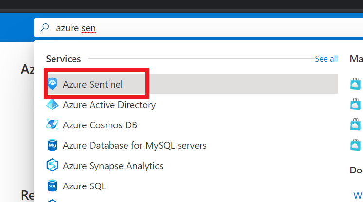

3. Select **Create**.
4. Select the **oilwells-logging-[YOUR INIT]** log analytics workspace.
5. Select **Add**.
6. Under configuration, select **Data connectors**.
7. Search for **IoT**.

    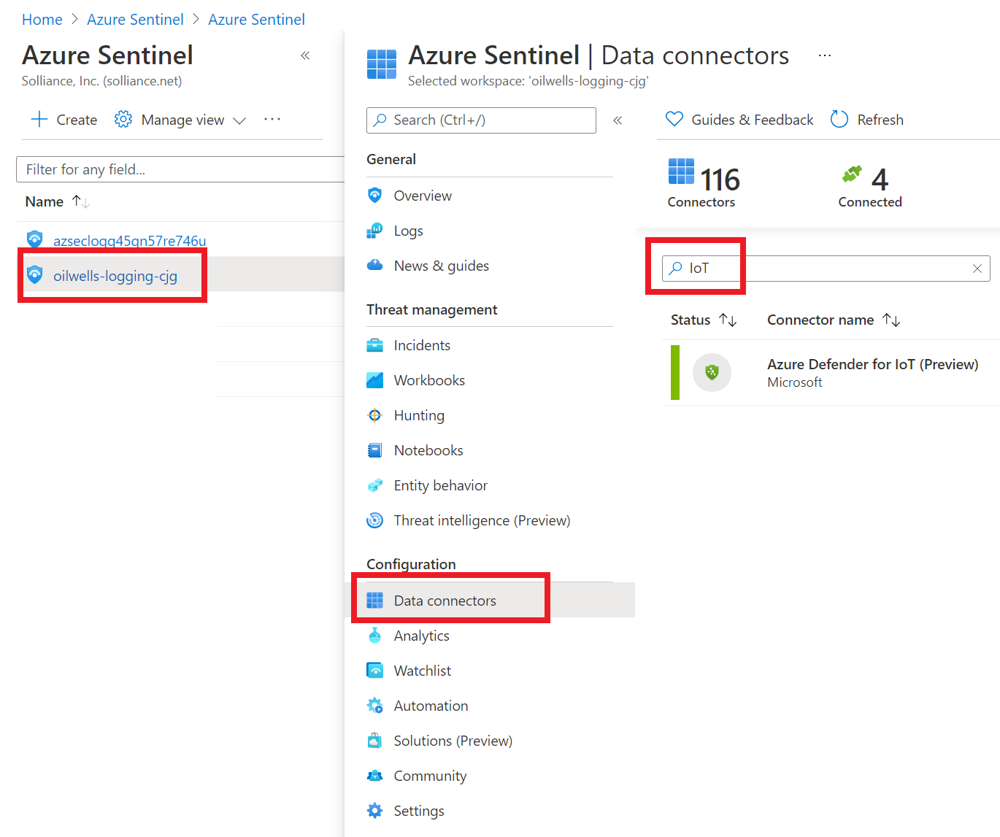

8. Select **Azure Defender for IoT**, then select **Open connector page**.
9. For your lab subscription, select **Connect**.
10. For the **Create incidents**, select **Enable**.
11. Browse back to Azure Sentinel.
12. Search for **Microsoft Defender for EndPoint**, then select **Open connector page**.
13. Select **Connect**.
14. For the **Create incidents**, select **Enable**.
15. Browse back to Azure Sentinel.

### Task 2: Create Linux Hybrid Worker

1. On the **Win10** virtual machine, open a PowerShell window, run the following, be sure to replace the value to match your lab environment:

    ```PowerShell
    Connect-AzAccount

    Set-AzOperationalInsightsIntelligencePack -ResourceGroupName <resourceGroupName> -WorkspaceName <workspaceName> -IntelligencePackName "AzureAutomation" -Enabled $true
    ```

    > **Note** You may need to switch to the target subscription if you have more than one.

2. Switch to the Azure Portal.
3. Browse to the **oilwells-automation-INIT** Automation Account.

    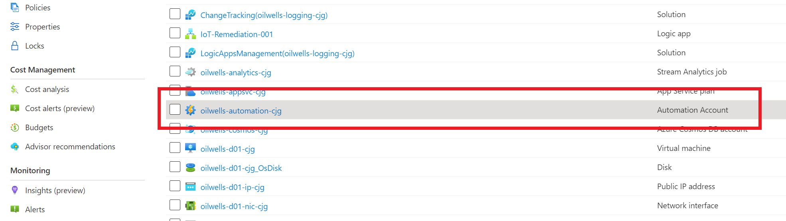

4. Under **Configuration Management**, select **Inventory**.
5. Select **Enable**.
6. Under **Update Management**, select **Update management**.
7. Select **Enable**.
8. Under **Account Settings**, select **Keys**, copy the primary access key and the URL.

    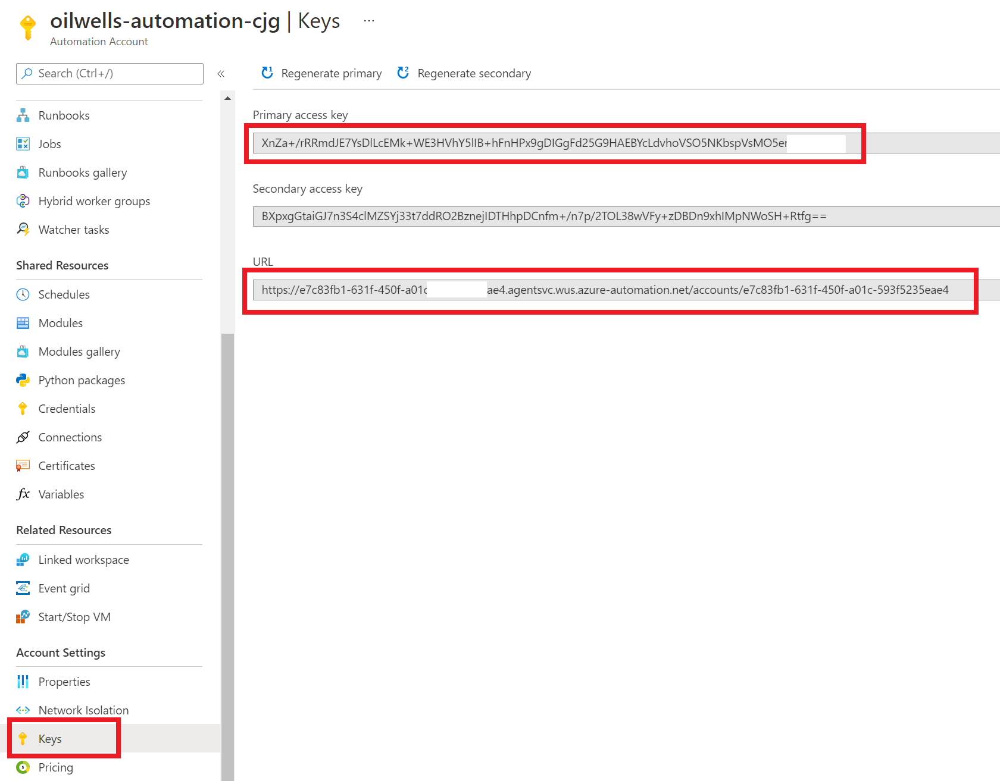

9. Switch to the **oilwells-edge-001** virtual machine SSH session.

10. Run the following commands to add the VM to a Hybrid worker, be sure to replace the values to match your environment.  Set the **hybridGroupName** to "IoTEdge":

    ```PowerShell
    sudo /opt/microsoft/omsagent/bin/service_control restart <YOUR_WORKSPACE_ID>

    sudo python /opt/microsoft/omsconfig/modules/nxOMSAutomationWorker/DSCResources/MSFT_nxOMSAutomationWorkerResource/automationworker/scripts/onboarding.py --register -w <YOUR_WORKSPACE_ID> -k <automationSharedKey> -g <hybridGroupName> -e <automationEndpoint>
    ```

11. Switch back to the Automation Account.
12. Under **Process Automation**, select **Hybrid worker groups**, you should now see the **IoTEdge** group displayed.

    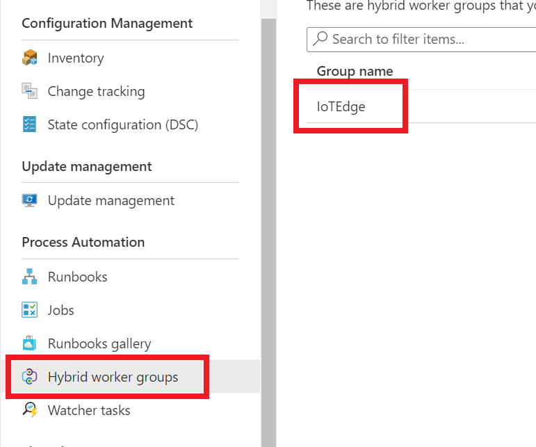

13. Under **Process Automation**, select **Runbooks**.
14. Select **Create a runbook**.
15. For the name, type **Reboot**.
16. For the type, select **Python 3**.
17. Select **Create**.
18. In the script window, copy the following:

    ```PowerShell
    sudo reboot
    ```

19. Select **Save**.
20. Select **Publish**, in the dialog, select **Yes**.

### Task 3: Create a Logic App

1. Browse back the Azure Portal.
2. In the global search, search for **Logic Apps**, select it.
3. Select **+Add**.
4. Select the lab subscription and resource group.
5. For the type, select **Consumption**.
6. For the name, type **Reboot**.
7. Select the **Enable log analytics** checkbox.
8. Select the **oilwells-logging-INIT** log analytics workspace.
9. Select **Review + create**.
10. Select **Create**, once it is created, select **Go to resource**.
11. Select **Blank Logic App**.
12. For the trigger, select **When Azure Sentinel incident creation rule was triggered**.
13. Select **Sign in**.
14. Select the **+** button in the workspace, then select **Add an action**.
15. Search for **Create job** in the **Azure Automation** namespace.
16. Select it, then select **Sign in**.
17. Select the lab subscription and resource group.
18. Select the automation account.
19. Add the Hybrid Automation Worker Group parameter, set to `IoTEdge`.
20. Add the Runbook Name parameter, select **Reboot**.

    

21. Select **Save**

### Task 4: Configure an Alert / Incident

1. Switch to the Azure Portal and Azure Sentinel.
2. Select the log analytics workspace if needed.
3. Under **Configuration**, select **Automation**.
4. Select **Create->Add new rule**.
5. For the name, type **Reboot**.
6. For the actions, select **Run playbook**.
7. Select the **Manage playbook permissions** link.

    

8. Select the lab resource group.
9. Select **Apply**.
10. Select the **Reboot** playbook.
11. Select **Apply**.

    

### Task 5: Manually create an Incident

1. Open the `\Hands-on lab\Scripts\CreateIncident.ps1` in Windows PowerShell ISE.
2. Update the values in the script, press **F5** to run it.
3. Browse back to Azure Portal and Azure Sentinel.
4. Select **Incidents**, you should see a new incident.

    

5. As part of the incident, you will see that the runbook has executed and thus, the worker in the run group will reboot.

## Exercise 10: Azure Defender for IoT (Optional)

Duration: 30-120 minutes

This exercise will show you how to install the Azure Defender for IoT agent and management console.

### Task 1: Install Azure Defender for IoT Sensor (Pre-built)

1. Due to the nature of the software and the install process, this can take up to 60 minutes to complete, if this is a route you'd like to take, move to Task 2.
2. You can simply start the **IoT Sensor** image and preform the following instead:

    - You will need to get the IP address of the host machine. Run `ipconfig` on the windows 10 host. Copy the IP address, this will become your `gateway IP`.
    - Switch to the `oilwells-edge-001` device.
    - Run `ifconfig`, copy the IP address and the subnet.
    - Start the VM.
    - Login using `support` with password `S2@dmins2@dmin123`.
    - Run the following command.

    ```bash
    network edit-settings
    ```

    - For the IP address, add `15` to the server IP host value.
    - For the subnet, copy the subnet you output above.
    - Set the DNS to `8.8.8.8`.
    - For the gateway enter the Windows 10 host IP.
    - Leave all other values, the image will reboot.
    - On the Windows 10 host, open an Edge browser window to the IP Address you gave the console. If prompted, select **Show advanced**, and then select **Proceed to IP ADDRESS (unsafe)**.
    - Login using `cyberx` with password `S2@dmins2@dmin123`.
    - Explore the sensor dashboard and pages.

### Task 2: Install Azure Defender for IoT Sensor (From scratch)

1. Login to the **win10** virtual machine.
2. Open the Azure Portal.
3. Browse to the **Security Center** portal.
4. Under **Cloud Security**, select **Azure Defender**, then select **IoT Security** to open the **Azure Defender for IoT** portal.
5. Select **Set up a sensor**.

    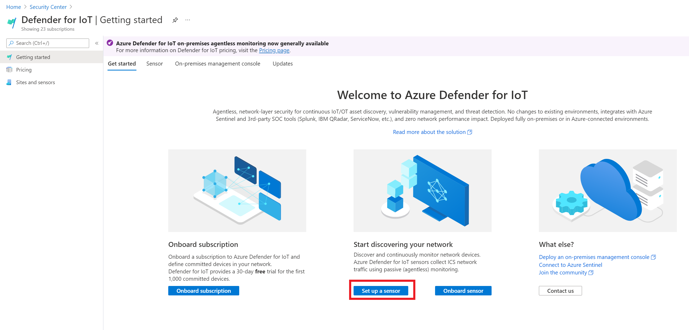

6. Select the **10.3.1 (Stable) and above** sensor, then select **Download**

    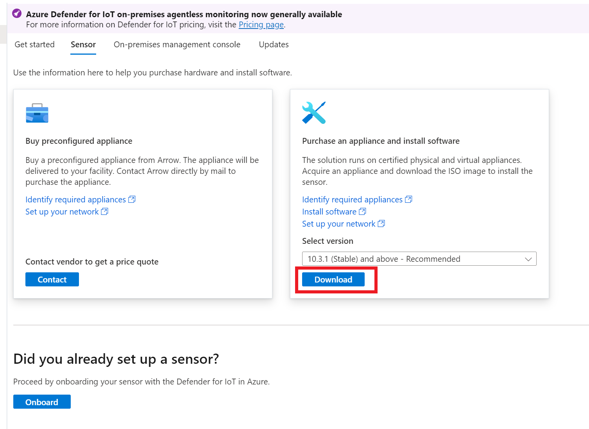

7. Select **Continue without submitting**.
8. Open the **Hyper-V manager** management console.
9. Select the local server.
10. Select **New->Virtual Machine**.
11. Select **Next**.
12. For the name, type **IoT Sensor**.
13. Select **Next**.
14. Select **Generation 2**, select **Next**.
15. Leave the memory setting at **2048**, select **Next**.
16. For the connection, select **Default switch**, select **Next**.
17. On the hard disk dialog, select **Next**.
18. Select the **install an operating system from a bootable image file**, browse to the downloaded **sensor** ISO.
19. Select **Next**.
20. Select **Finish**.
21. Select **Settings**, then select **Add hardware**.
22. Select **Network Adapter**, then select **Add**.
23. Select **Processor**, for number of virtual processors, type **2**.
24. Select **OK**.
25. Select the new virtual machine, then select **Start**.
26. Right-click the virtual machine, select **Connect**.
27. In the setup, select your language, press **Enter**.
28. Select the **sensor-X.X.X.X-buildEnterprise** version, press **Enter**.  The software image will start to install.

    > **Note** This can take up to 20 mins to complete

29. Once the virtual machine is booted, select the `eth0` network interface, press **Enter**.
30. For the IP address, type **192.168.102.7**.
31. For the subnet mask, type **255.255.255.0**.
32. For the DNS, type **192.168.102.5**.
33. Type **Y**, press **Enter**.
34. Once all the updates and configuration is complete, record your `cyberx` login information then press **Enter**.
35. Record your `support` login information then press **Enter**.
36. Once the system restarts, open a web browser to the sensor console IP address.
37. Login using the `cyberx` login and password..
38. You will be prompted for the activation file which you will populate in the following tasks.

### Task 3: Install Azure Defender for IoT Management Console (Pre-Built)

1. Due to the nature of the software and the install process, this can take up to 60 minutes to complete, if you'd like to perform this lengthy task, jump to task 4 to do the manual install.
2. You can simply start the **IoT Management Console** image and preform the following instead:

    - You will need to get the IP address of the host machine. Run `ipconfig` on the windows 10 host. Copy the IP address, this will become your `gateway IP`.
    - Switch to the **oilwells-edge-001** device.
    - Run `ifconfig`, copy the IP address and the subnet.
    - Start the VM.
    - Login using `cyberx` with password `S2@dmins2@dmin`.
    - Run the following command.

    ```bash
    sudo cyberx_management_network_reconfigure
    ```

    - For the IP address, add `10` to the server IP host value.
    - For the subnet, copy the subnet you output above.
    - Set the DNS to `8.8.8.8`.
    - For the gateway enter the Windows 10 host IP.
    - Leave all other values, the image will reboot.
    - On the Windows 10 host, open an Edge browser window to the IP Address you gave the console.

### Task 4: Install Azure Defender for IoT Management Console (Manual)

1. Switch back to the Azure Portal and the Azure Defender for IoT page.
2. If the download dialog is displayed, select **Close**.
3. In the top navigation, select **On-premises management console**.
4. Select the **10.3.1 (Stable) and above** sensor, then select **Download**.
5. Open the **Hyper-V manager** management console.
6. Select the local server.
7. Select **New->Virtual Machine**.
8. Select **Next**.
9. For the name, type **IoT Console Manager**.
10. Select **Next**.
11. Select **Generation 2**, select **Next**.
12. Leave the memory at **2048**, select **Next**.
13. For the connection, select **Default switch**, select **Next**.
14. On the hard disk dialog, select **Next**.
15. Select the **install an operating system from a bootable image file**, browse to the downloaded **console manager** ISO.
16. Select **Next**.
17. Select **Finish**.
18. Select **Settings**, then select **Processor**, for number of virtual processors, type **2**.
19. Select **OK**.
20. Select the new virtual machine, then select **Start**.
21. Right-click the virtual machine, select **Connect**.
22. In the setup, select your language, press **Enter**.
23. Select the **sensor-X.X.X.X-buildEnterprise** version, press **Enter**.  The software image will start to install.

    > **Note** This can take up to 20 mins to complete

24. Once the virtual machine is booted, type **enterprise** for the hardware profile, then press **Enter**.
25. For the management network interface, select `eth0`, press **Enter**.
26. For the IP address, type **192.168.102.50**.
27. For the DNS, type **192.168.102.5**.
28. For the gateway, type **192.168.102.1**.
29. For the input interface, type **eth1**.
30. For the bridge interface, type **eth0**.
31. Type **Y**, press **Enter**.
32. Once all the updates and configuration is complete, record your `cyberx` login information then press **Enter**.
33. Record your `support` login information then press **Enter**.
34. Once the system restarts, open a web browser to the management console IP Address.
35. Login using the `cyberx` login and password.
36. Select the **Use a locally generated self signed certificate...** option, select select **I Confirm**.
37. Select **NEXT**.
38. Select **FINISH**.

### Task 5: Onboard subscription

1. Switch back to the Azure Portal and the Azure Defender for IoT page.
2. Select **Pricing**.
3. Select **Onboard subscription**.

    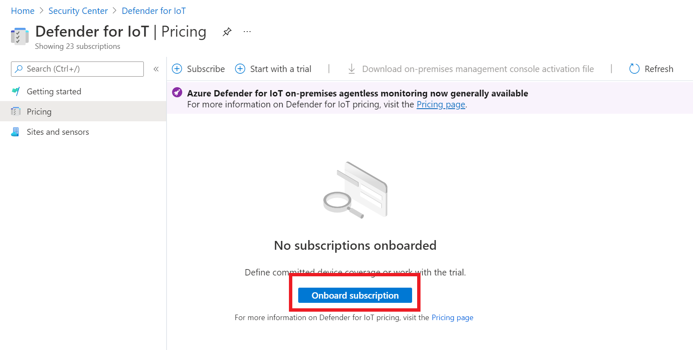

4. Select the lab subscription.
5. Select **Subscribe**, in the dialog select **Confirm**.

> **Note** An onboarded subscription is free for the first 30 days, then is [charged at $2000/month](https://azure.microsoft.com/en-us/pricing/details/azure-defender/) per 1000 devices.  Be sure that you deallocate your subscription when done!

### Task 6: Onboard a Sensor

1. Switch back to the Azure Portal and the Azure Defender for IoT page.
2. Select **Sites and Sensors**.
3. Select **Onboard sensor**.
4. For the name, type **sensor-001**.
5. Select your lab subscription.
6. Select your IoT Hub.
7. For the site name, type **default**.
8. Select **Register**.
9. Select **Download activation file**.
10. Switch to your sensor browser session.
11. Select **Upload**, then select **Browse File..**.
12. Select the **sensor-001_license.zip** file you just downloaded.
13. Select the **Approve these Terms and Conditions** check box.
14. Select **Activate**, in the dialog select **OK**.
15. Select the **Use a locally generated self signed certificate...** option, select select **I Confirm**.
16. Select **NEXT**.
17. Select **FINISH**, your sensor is now ready to monitor network traffic and send data to Azure.

## Exercise 11: Device Messaging and Time Series Insights (Optional)

Duration: 15 minutes

This exercise will walk you through integrating Time Series Insights and then sending security log messages from a simulated device.

### Task 1: Setup Time Series Insights

1. Switch to the Azure Portal, select the **iotsecurity-\[your initials or first name\]** resource group.

2. Select the **oilwells-timeseries-\[your initials or first name\]** Time Series Insights environment.

    

3. Under **Settings**, select **Event Sources**.

4. Select **+Add**.

    

5. For the name, type **oilwells-iothub-\[your initials or first name\]**.

6. For the source, select **Iot Hub**.

7. Select your **oilwells-iothub-\[your initials or first name\]** IoT Hub.

8. For the IoT Hub policy name, select **iothubowner**

9. For the IoT Hub consumer group, select **$default**

10. Select **Save**.

11. In the blade menu, select **Data Access Policies**.

12. Select **+Add**.

13. Choose **Select user**, then search for your user account.

14. For the role, select **Reader** and **Contributor**.

15. Select **OK**.

16. Select **OK**.

### Task 2: Send Security Messages

1. Open the **\Hands-on-lab\simulated-device\simulated-device.sln** project.

2. From Solution explorer, open the **SimulatedDevice.cs** file.

    

3. Update the device connection string with your **oilwells-edge-001** device.

    

4. Review the code, notice it is simply creating a set of random event messages, some of which are security oriented.

5. Run the program, press **F5**.  Wait for this tool to run for 2-3 minutes.

### Task 3: Review the Time Series Portal

1. Switch to the Azure Portal.

2. Select the **iotsecurity-\[your initials or first name\]** resource group.

3. Select the **oilwells-timeseries-\[your initials or first name\]** Time Series Insights environment.

4. Select the **Go to TSI Explorer** link, close any dialogs.

    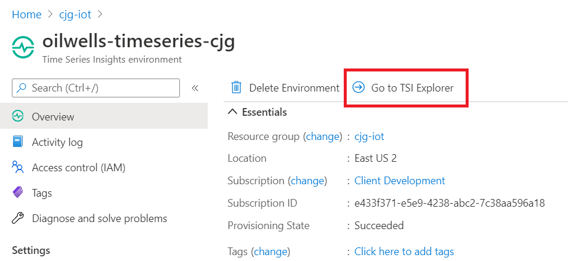

5. Select **Add new query**

6. Select a `from` and `to` date settings that fit to the window you ran the device security message simulation, select **Save**

   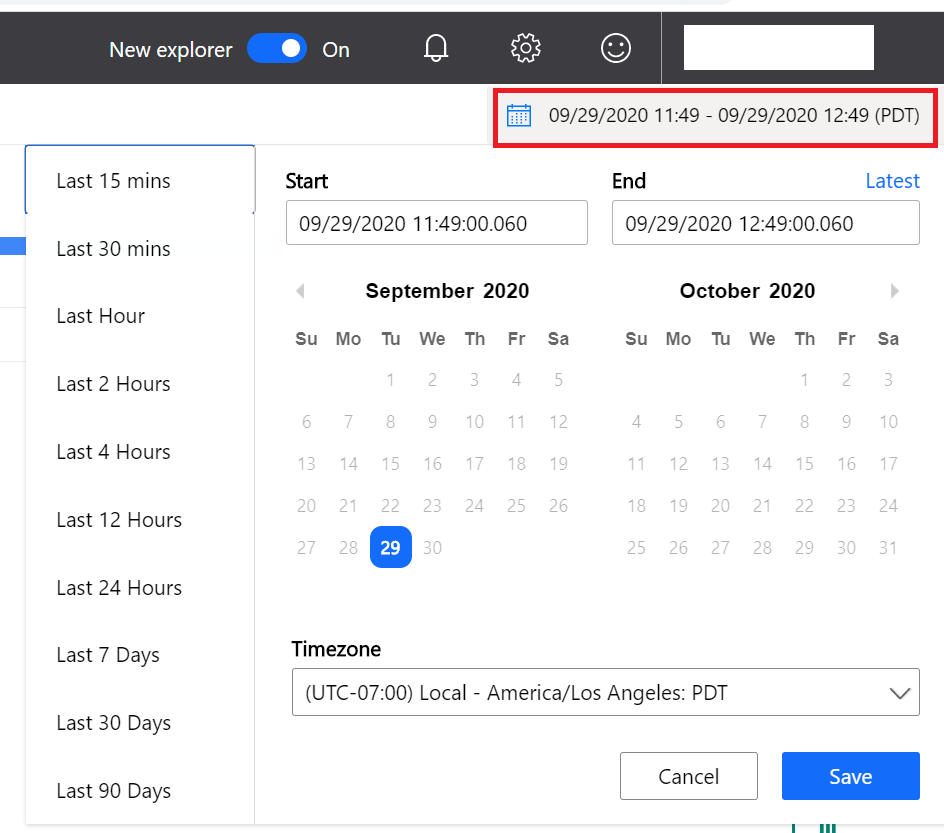

7. Select the **SPLIT BY** drop down, then select **SecurityAlert**.

8. In the filter, right-click the **Events/SecurityAlert/true** property, select **Show only this series**, you should now see all the custom message sent from the device(s) that were set to SecurityAlerts.

    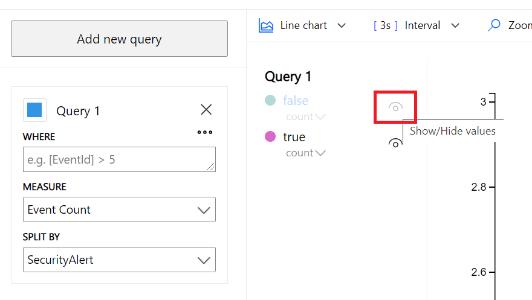

    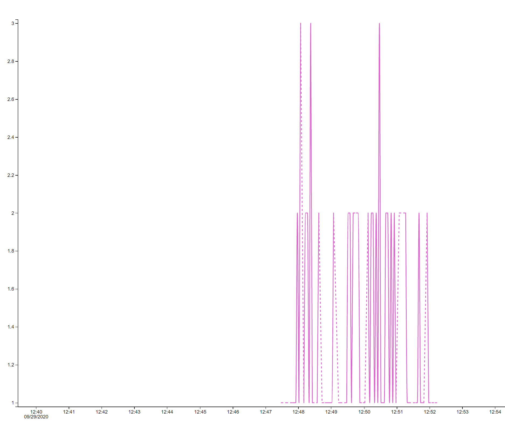

## Exercise 12: Perform an IoT Hub Manual Failover

Duration: 10 minutes

This exercise will have you perform an IoT Hub failover to a different region.

### Task 1: Perform a manual failover

1. Open the Azure Portal.

2. Browse to your IoT Hub.

3. In the blade menu, in the **Settings** section, select **Failover**.

4. In the top menu, select **Start failover**.

    

5. Type your IoT Hub name, then select **Failover**.  It can take several minutes to failover the IoT Hub.

    

## After the hands-on lab

Duration: 10 minutes

In this exercise, attendees will de-provision any Azure resources that were created in support of the lab.

### Task 1: Delete resource group

1. Using the Azure portal, navigate to the Resource group you used throughout this hands-on lab by selecting **Resource groups** in the menu.

2. Search for the name of your research group, and select it from the list.

3. Select **Delete** in the command bar, and confirm the deletion by re-typing the Resource group name and selecting **Delete**.

4. Switch to the Azure Defender for IoT portal, select **Pricing**

5. Select your lab subscription, select the ellipses, then select **Offboard subscription**

You should follow all steps provided *after* attending the Hands-on lab.